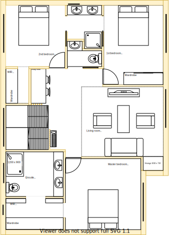

# Camellia Ct - Project Requirements Specification

In this respository you will find the full set of customer requirements for this project. These requirements will be found in the individually linked pages. Each requirement has been organised into the following categories:
1. Lower-level [LL]
2. Upper-level [UL]
3. Landscaping [LS]
4. Outer-building [OB]

Each category will be further classified and uniquely identified as a particular feature (eg. LLK refers to the requirements associated with lower-level dining room section). Each requirement will be documented as both an ID and a description in a table and should be costed individually if possible. Your costings will enable us to prioritise which features will form part of the final scope. All of these requirements are aspects of the property that need attention. Ideally, we can achieve them all within a big budget but if not we need to assess which ones to drop. 

My dad, sister, wife, my kids and I will assess the priority of those requirements in terms of your estimated cost. This will inform us on how best to proceed with this project.

Please note:
* All diagrams and models in this repository have been modeled by me! They have been modeled to get us all on the same page and understand the scope of this project. These models will serve as a source of input for the deliverables that Brett produces. Hence, they are a starting point of which I suspect you all will see glaring home improvements to make through your direct experiences.
* All measurements in the "Actual" views were recorded in cm and represent my best efforts. I recommend using these measurements as a guide **ONLY** and use Brett's measurements as authoratative when he comes here. Note, I have since aligned by models with Brett's conceptual model which weres created using an electronic measurement device.
* All position of building fixtures are to scale in the "Actual" view and estimated to be to scale in the "Expected" model 
* I have attempted to model all aspects because of the inherent inter-relationship of the features (eg. in order to quote on the lower-level renovation, there are assumptions on where the staircase is going to be to get to the upper-level and the removal of walls to accomodate it)
* Where possible I have also identified known issues below the requirements to draw your attention to a concern that may affect the design and/or cost estimation.
* On several requirements sections I have documented questions which affect decisions. I would appreciate your responses to these questions.
* My family have tasked me with finding a way to make every cent sunk into this project yield its greatest value. Please let me know if there are things that you recommend that I do in order to reduce your workload such that I can reduce our overrall costs during scope finalisation and build.
* It's important to realise that this project is financed through different funding stakeholders in my family. I have documented all the requirements indicating that the stakeholders may extend the budget to $250K if the value proposition is there.
* I would really appreciate you collaborating with me and each other on how things can be done better and cheaper!

## Design principles

There are design principles that I have used to govern my architectural choices, and design decisions. They should equally inform your options with respect to architecture, design, fixtures, furnishings, materials and other build related decisions and considerations. 

1. Embrace value for money first, but select premium if just 20% more than standard pricing
2. No maintenance over low/some maintenance
3. Embrace natural lighting and reduce demand on heating/cooling systems
4. Fixtures and furnishings value function over form 
5. Centralise shared building services/resources over decentralisation
6. Rooms/resources that are used together should be adjacent to one another
7. Rooms/resources that are frequented in terms of time spent/people should attract more space/investment than others
8. Reduce overall transit as the basis of location

## Feature

All requirements have been mapped to features that are located in sections. This mapping is outlined in the table below:

|Feature|Inter-level properties|Lower Level|Upper Level|Outer|
|:---|:---|:---|:---|:---|
|Master bedroom|same if incl lower-level wardrobe|[Section C](./lower-level/section-C-requirements.md)|[Section S](./upper-level/section-S-requirements.md)||
|Master bedroom ensuite|upper-level larger|[Section B](./lower-level/section-B-requirements.md)|[Section R](./upper-level/section-R-requirements.md)||
|Master Walk through wardrobe|upper-level only||[Section T](./upper-level/section-T-requirements.md)||
|1st bedroom|upper-level larger|[Section G](./lower-level/section-G-requirements.md)|[Section M](./upper-level/section-M-requirements.md)||
|2nd bedroom|upper-level larger|[Section E](./lower-level/section-E-requirements.md)|[Section O](./upper-level/section-O-requirements.md)||
|Main bathroom|similar, lower-level incl bathtub|[Section D](./lower-level/section-D-requirements.md)|[Section N](./upper-level/section-N-requirements.md)||
|Kitchen|shared|[Section H](./lower-level/section-H-requirements.md)|||
|Pantry|shared|[Section J](./lower-level/section-J-requirements.md)|||
|Lounge|similar size, similar position|[Section F](./lower-level/section-F-requirements.md)|[Section Q](./upper-level/section-Q-requirements.md)||
|Dining|shared|[Section K](./lower-level/section-K-requirements.md)|||
|Entry|shared|[Section I](./lower-level/section-I-requirements.md)|||
|Laundry|shared|[Section A](./lower-level/section-A-requirements.md)|||
|Study|shared||[Section P](./upper-level/section-P-requirements.md)||
|Rumpus|shared||[Section L](./lower-level/section-L-requirements.md)|||
|Shed & clothes line|shared|||[Section U](./landscape/section-U-requirements.md)|
|Front carport|shared|||[Section V](./landscape/section-V-requirements.md)|
|Outside retreat|shared|||[Section W](./landscape/section-W-requirements.md)|

Table 1: Features

---

## Requirements

The requirements have been organised into the following main categories:
1. [Lower-Level requirements](./lower-level/Lower-Level-requirements.md)
2. [Upper-Level requirements](./upper-level/Upper-Level-requirements.md)
3. [Landscape requirements](./landscape/Landscape-requirements.md)
4. [Outer building requirements](./outer-building/Outer-building-requirements.md)

<table>
  <tr>
    <td align="center"><b>Lower</b></td><td align="center"><b>Upper</b></td>
  </tr>
  <tr>
    <td valign="top"></td><td valign="top"></td>
  </tr>
</table>

Table 2: Lower & upper levels side-by-side 

Please, visit the above links to understand the complete set of requirements.
