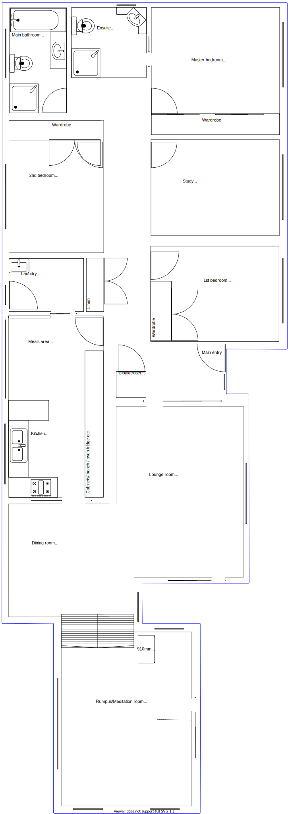
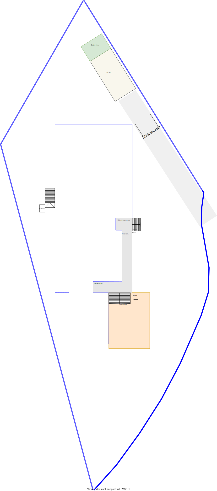

# House-prj public

This repo has been setup to collaborate with Brett. These are ONLY just my thoughts and models that I intend share with Brett! This repository can be used by Brett and myself to review any/all revisions of documentation or models that I have authored and published. Put simply it is less error prone than collaborating via email.

## Requirements
The wishlist is as follows:
- accommodation for dad & sister
  - 1 main bedroom w/ ensuite
  - 1 small bedroom
  - 1 leasure area
  - 1 extra toilet
- kitchen reno (no workspace in current kitchen for wife, daughter and sister to all cook together)
- general house reno incl:
  - bathrooms reno
  - fix up water pressure and hammering
  - fix up electricity from tripping/surges
  - fix outdated windows/wardrobes/doors/carpets around house

## Design principles
1. satisfy budget (I value function over form factor)
2. no maintenance over low/some maintenance (eg. we have no interest in gardening etc)
3. embrace natural lighting and reduce demand on heating/cooling systems
4. embrace value for money & higher quality if premium is just 20% more than standard pricing (eg your double glazing case)
5. accessibility and position of features is intuitive and not cumbersome (eg stair case)
6. consider resale

## Known issues with current configuration (ie. pain points)
1. kitchen workspace is too small for collaboration and non-trivial preparations 
2. lack of natural light in dining room (need to turn lights on almost all the time)
3. summer sun
    * morning summer sun from the east  through the window next to the main entry causes the hallway to become very hot
    * evening summer sun from the west through the kitchen, meals area and laundry causes those respective areas to become extremely hot
4. laundry back door next to sink is too difficult to exit from and also too high (1.2m) from the ground. Thus, it is not really used
5. driveway is 2.24m wide between corner of house and fence and thus the carport is not used (thinking about repurposing this as a more secluded outdoor area)
6. both north and south triangular regions of the property are mostly unused (thinking about putting an secondary driveway at the southen end)
7. there is only a single window/wall aircon in the dining room
8. Rumpus/meditation room (almost 1m drop) is typically 2-4 degrees colder than rest of house (good in the summer, but very cold in winter)

## Models

The most recent update of the current floor plan is:

* You can [load the above image directly into the browser](https://raw.githubusercontent.com/ashinw/house-prj-pub/master/house_floor_plan.svg) and use the zoom in/out browser features for a better viewing experience.

The most recent update of the current title & outdoor plan is:

* You can [load the above image directly into the browser](https://raw.githubusercontent.com/ashinw/house-prj-pub/master/title_and_outdoor_plan.svg) and use the zoom in/out browser features for a better viewing experience.

The most recent update of the current combined floor, title & outdoor plan is:

* You can [load the above image directly into the browser](https://raw.githubusercontent.com/ashinw/house-prj-pub/master/combo_title_and_outdoor_and_floor_plan.svg) and use the zoom in/out browser features for a better viewing experience.