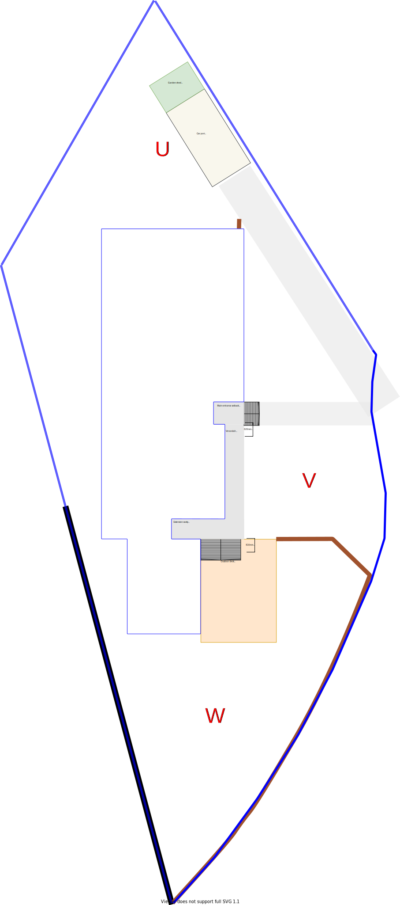

# Landscape Requirements

The landscape requirements are requirements that are dis-joined to the core building structure.

Again, section labels have been applied to present regions that require attention.

|Actual landscape|Expected landscape|
|:---:|:---:|
|||

Table LS1: Actual vs Expected landscape

Using the above diagrams as a guide, visit each link in the Landscape Section Requirements table below to assess the complete set of requirements for the upper-level.

|Section Group|Expected|
|:---|:---|
|[Section U](./section-U-requirements.md)|North Backyard|
|[Section V](./section-V-requirements.md)|Open front car port|
|[Section W](./section-W-requirements.md)|South Backyard|

Table LS2: Landscape Section Requirements
