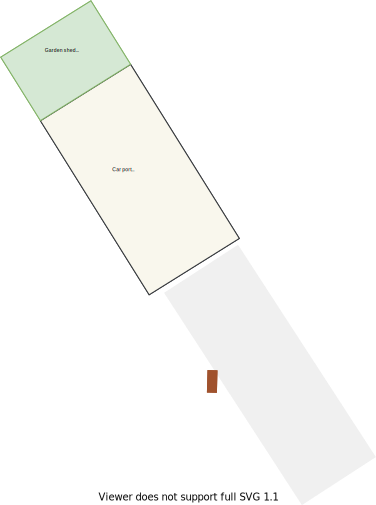
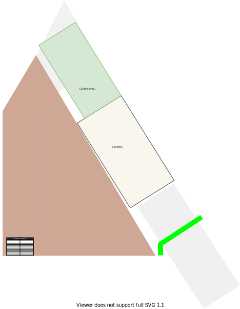
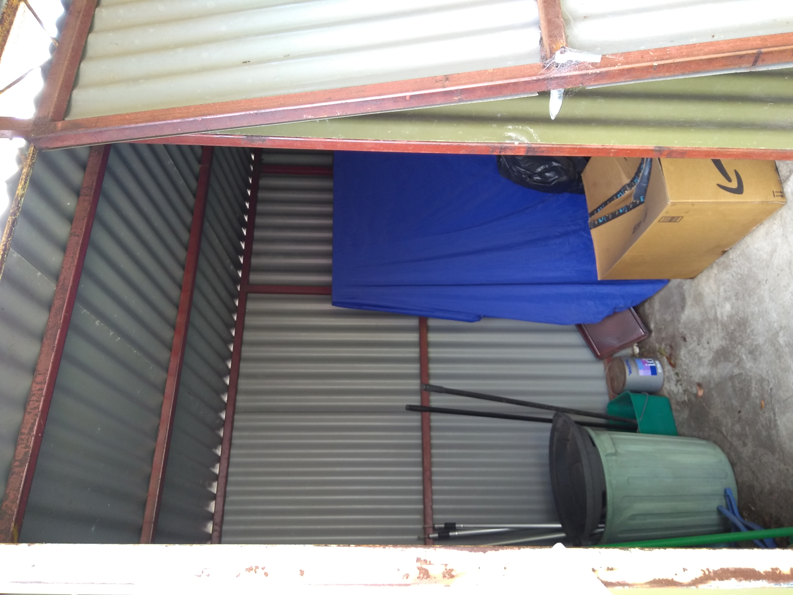
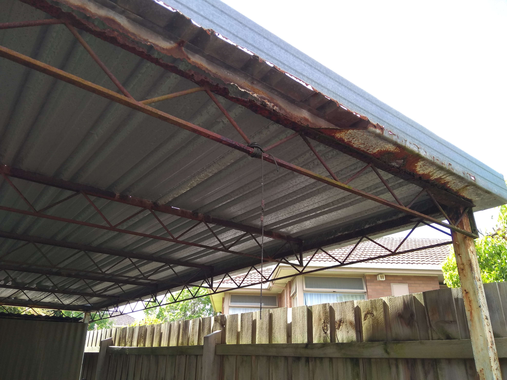

# Section U - North Backyard

## Context

Section U represents the backyard for the clothes line, shed, and carport.

Figure LS2: Expected landscape

There is/are currently:
* A clothes line
* A shed
* A car port
* The remainder of an old backyard & car port gate

## Problem
1. There is a slope from the east neighbour's fence line to the west neighbour's fence line
2. The shed is small with a broken door
3. The open car port has rusted gutters 
4. There is a stump north of the shed
5. There is a tree and bushes along the north west fence line
6. There is a lack of storage space in the house
7. There is a clothes line
8. There is no privacy gate into the backyard

## Solution

1. Landscape the north backyard and make it more fit for purpose with better space utilisation

|Actual|Expected|
|:---:|:---:|
|||

Table LS-U1: Landscape comparison

## Requirements

|ID|Description|Est. Cost|Alternative Solution Cost|
|:---|:---|:---|:---|
|LSU-REQ1|Remove stump, tree and remaining bushes along the north west fence line|||
|LSU-REQ2|Flatten the area in preperation for the north backyard concreting|||
|LSU-REQ3|To accomodate a larger shed extend the concrete slab to the north of the fence lines using standard concrete Area = 8.4m^2|||
|LSU-REQ4|Concrete north backyard with exposed [aggregate concrete](#References) #1 Area = 48m^2|||
|LSU-REQ5|Install steps down from laundry|||
|LSU-REQ6|Replace shed with [larger shed](#References) #2|||
|LSU-REQ7|Repair/replace car port's rusted gutters|||
|LSU-REQ8|Install car port entrance gate into backyard|||

## Photos

Photo: LSU-photo-1 - Slope

Photo: LSU-photo-1 - Stump removal

Photo: LSU-photo-1 - Tree and bush removal

Photo: LSU-photo-1 - Broken shed door

Photo: LSU-photo-1 - Rusted gutters

Photo: LSU-photo-1 - Old car port gate

## References

1. https://www.decorativeconcretewa.com.au/aggregate-vs-stamped-concrete/
2. https://www.bunnings.com.au/endurashed-4-5-x-2-25-x-2-35m-tall-truss-roof-garden-shed-zincalume_p0076422
3. https://www.melbournegatesandfencing.com.au/our-services/fencing/colorbond-fencing/