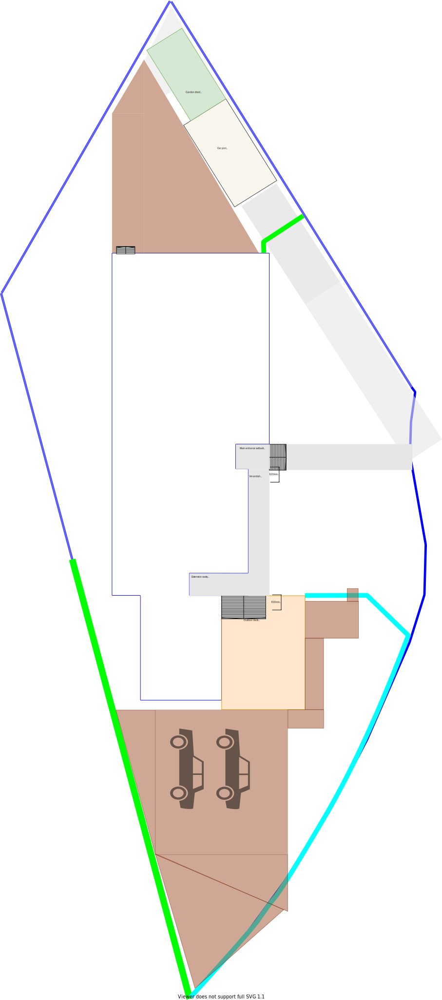
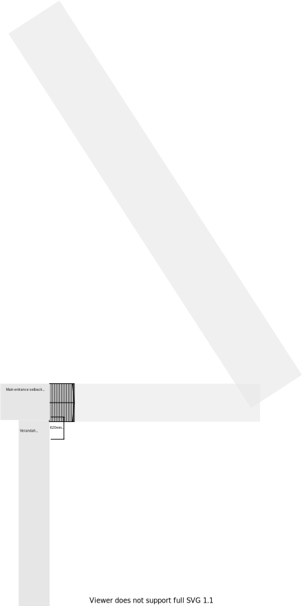
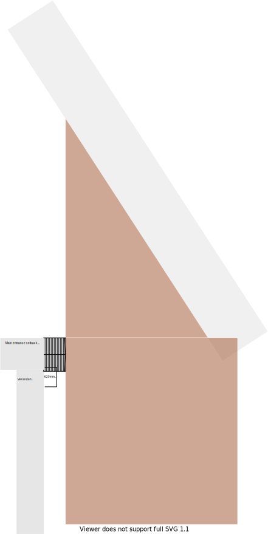
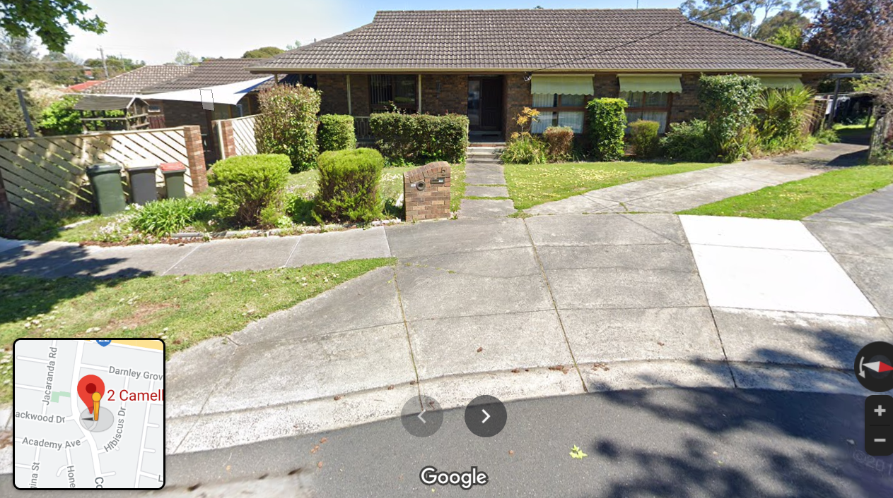

# Section V - Frontyard

## Context

Section V represents the frontyard for the property that leeds from the footpath to the front door.

Figure LS2: Expected landscape

There is/are currently:
* A driveway
* A garden bed by the footpath
* A garden bed in front of the verandah and front of the house
* A footpath leading to the front stair case and steps 

## Problem
1. There is a slope from driveway to the front of the house
2. There is no garage and the car port driveway entry is too narrow for a standard modern vehicle sqeeze through between the house and the fence
3. Our smaller vehicle is almost always street parked which means groceries are carried further after a shopping run
4. Parking on the grass area to the east of the house frequently creates skid marks and a lot of mud due to a lot of water retention on the soils surface 
5. Vehicles must navigate around a council to enter the preferred location

## Solution

Landscape the east frontyard to accomodate vehicle parking
1. Remove brick letterbox and east most garden bed
2. Remove original concrete foot path to entry
3. Flatten the entire area in preparation for the concreting
4. Floor the frontyard with exposed [aggregate concrete](#References) #1 Area = 83m^2

Applicable principles:
* Embrace value for money first
    - Avoid paying for cross-over permit and creating cross-over
    - Aggregate concrete is better value for money over other outdoor flooring solutions
* No maintenance over low/some maintenance
    - Reduced amount of garden maintenance
* Reduce overall transit as the basis of location
    - Short distance and travel time from car to kitchen to empty groceries

|Actual|Expected|
|:---:|:---:|
|||

Table LS-U1: Landscape comparison

## Requirements

|ID|Description|Est. Cost|Alternative Solution Cost|
|:---|:---|:---|:---|
|LSV-REQ1|A carport shall enable vehicles to park directly in front of the house|||

## Photos

Photo: LSV-photo-1 - Front garden bed and letter box

Photo: LSV-photo-2 - Slope

## References

1. https://www.decorativeconcretewa.com.au/aggregate-vs-stamped-concrete/