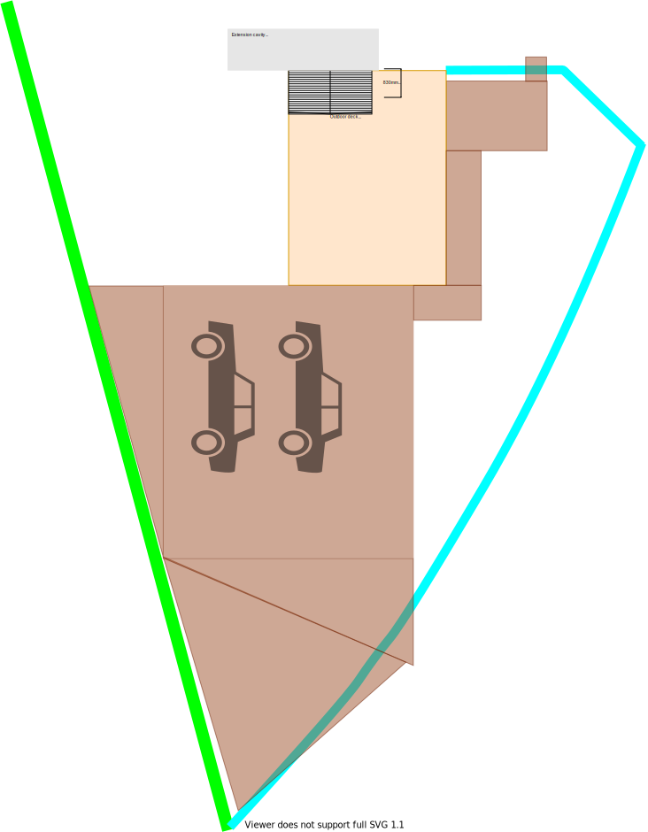

# Section W - South Backyard

## Context

Section W represents the frontyard for the property that leeds from the bottom on the property boundary to the area around the deck.

Figure LS2: Expected landscape

There is/are currently:
* A fence with the neighbouring south west property
* A fence and gate beside the deck separating front (north/east) and backyards (south)
* The south east fence line has large yellow palings with brick pillars in between
* A deck with a stair case to the verandah

## Problem

1. The fence with neighbouring south west property is dilapidated
2. The fence between the front and backyards have some broken palings
3. The fence's gate is broken off entirely
4. The deck has one broken piece of timber along the south side
5. The stair case has a loose and step supported by a red oil jack
6. Two broken pillars along the south east fence line have fractures and cracks
7. The large yellow palings along the south east fence line reflects a lot of the afternoon western sun light back to the house
8. The large gaps between the palings prohibit privacy
9. There is a lot of water retension in the grass areas and it can be slushy walking through the gate to the deck

## Solution

1. Landscape the south backyard to make more fit for purpose

|Actual|Expected|
|:---:|:---:|
|||

Table LS-U1: Landscape comparison

## Requirements

|ID|Description|Est. Cost|Alternative Solution Cost|
|:---|:---|:---|:---|
|LSW-REQ1|Organise with neighbour and replace fence with durable [colorbond fence](./#References) #2 for length = 24m|||
|LSW-REQ1|Repair/replace damaged fence palings|||
|LSW-REQ2|Repair/replace damaged gate|||
|LSW-REQ2|Repair cracked fence pillars|||
|LSW-REQ2|Repaint from yellow to dark brown matching house brickwork length = 28m|||
|LSW-REQ2|Install light duty shade cloth along inner side of south east fence line for greater privacy length = 28m|||
|LSW-REQ2|Replace broken timber plank on side of deck and stain plank|||
|LSW-REQ4|Floor the gate passage and deck entry with exposed [aggregate concrete](#References) #1 Area = 3m^2|||

## Photos

Photo: LSW-photo-1 - Dilapidated south west fence

Photo: LSW-photo-1 - Broken gate held in place by rope

Photo: LSW-photo-1 - Cracked palings

Photo: LSW-photo-1 - Fractured pillars

Photo: LSW-photo-1 - Loose stair case step

## References

1. https://www.decorativeconcretewa.com.au/aggregate-vs-stamped-concrete/
2. https://www.melbournegatesandfencing.com.au/our-services/fencing/colorbond-fencing/
3. https://www.bunnings.com.au/coolaroo-1-83m-wide-70-uv-light-duty-shade-cloth-per-metre-green_p3300389?gclid=CjwKCAjw5p_8BRBUEiwAPpJO61QZm8EjOosBbOiiCcjVjRz0d7oTgsQlsxPkkxrPe0wsOwxhU3UlcRoCXI0QAvD_BwE&gclsrc=aw.ds