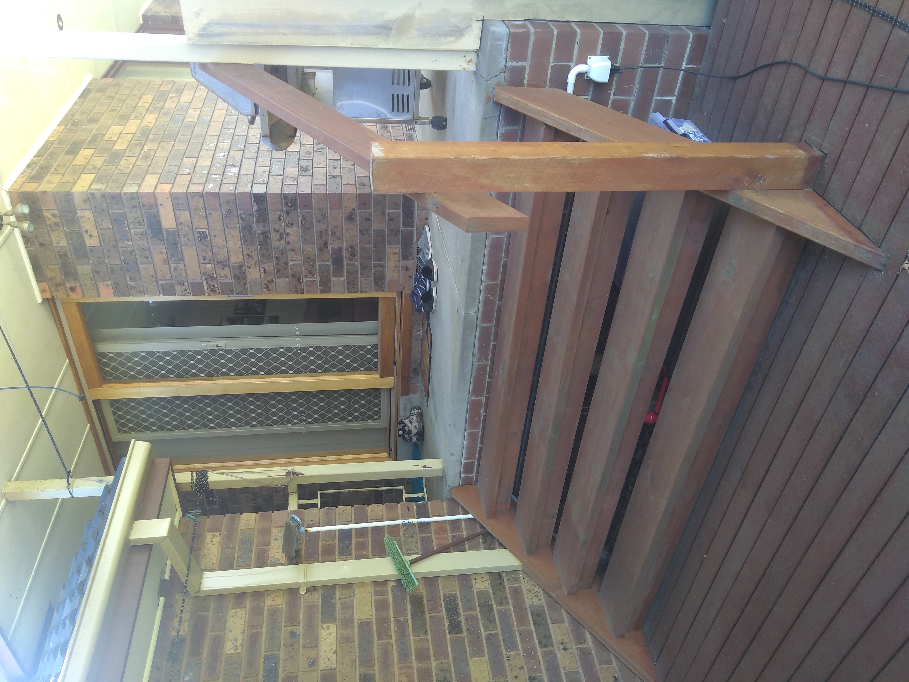

# Section W - South Backyard

## Context

Section W represents the frontyard for the property that leeds from the bottom of the property boundary to the area beside the deck.

Figure LS2: Expected landscape

There is/are currently:
* A fence with the neighbouring south west property
* A fence and gate beside the deck separating front (north/east) and backyards (south)
* The south east fence line has large yellow palings with brick pillars in between
* A deck with a stair case to the verandah

## Problem

1. The fence with the neighbouring south west property is dilapidated
2. The fence between the front and backyards have some broken palings
3. The fence's gate between the front and backyards is broken off entirely
4. The deck has one broken piece of timber along the south side
5. The yellow fence along the south east has two broken pillars, fractures and cracks
6. The large yellow palings along the south east fence line reflects a lot of the afternoon western sun light back to the house
7. The large gaps between the palings prohibit privacy
8. There is a lot of water retension in the grass areas and it can be slushy walking through the gate to the deck
9. The stair case has a loose step and is currently supported by a red oil jack
10. The main outdoor garden tap that is connected to the meter occasionally drips despite being tighly closed

## Requirements

|ID|Description|Est. Cost|Alternative Solution Cost|
|:---|:---|:---|:---|
|LSW-REQ1|A new fence with the neighbouring south west property shall be erected|||
|LSW-REQ2|The main fence along the south east shall be refurbished|||
|LSW-REQ3|The main fence shall have a shade cloth pinned into its inner side providing privacy and reduced reflected light|||
|LSW-REQ4|The deck shall be refurbished|||
|LSW-REQ5|There shall be an aggregate concrete floor or similar to move between the car port and the deck|||
|LSW-REQ6|There shall be a new garden tap connected to the meter|||

## Solution

|Actual|Expected|
|:---:|:---:|
|||

Table LS-U1: Landscape comparison

|Design principles|
|:---|
|Embrace value for money first, but select premium if just 20% more than standard pricing|
|No maintenance over low/some maintenance|

Table LS-W2: The design principles that should be influencing the solution's location/choices/decisions

### Steps

Landscape the south backyard to make more fit for purpose
1. Organise with neighbour and replace fence with durable [colorbond fence](./#References) #2 for length = 24m
2. Repair/replace damaged fence palings along yellow fence
3. Repair cracked fence pillars
4. Repaint from yellow to dark brown matching house brickwork length = 28m
5. Install [light duty shade cloth](#References) #3 along inner side of south east fence line for greater privacy length = 28m
6. Repair/replace damaged gate between deck and new carport
7. Replace broken timber plank on side of deck and stain plank
8. Floor the gate passage and deck entry with exposed [aggregate concrete](#References) #1 Area = 3m^2
9. Replace garden tap

### Consideratiions
* Corrugated fencing is just 10% more than timber
* Aggregate concrete is better value for money over other outdoor flooring solutions
* Shade cloth & darker paint along fence line is cheap solution to reducing reflective light/heat

## Photos

Photo: LSW-photo-1 - Dilapidated south west fence

Photo: LSW-photo-1 - Broken gate held in place by rope

Photo: LSW-photo-1 - Cracked palings

Photo: LSW-photo-1 - Fractured pillars

Photo: LSW-photo-1 - Loose stair case step

## References

1. https://www.decorativeconcretewa.com.au/aggregate-vs-stamped-concrete/
2. https://www.melbournegatesandfencing.com.au/our-services/fencing/colorbond-fencing/
3. https://www.bunnings.com.au/coolaroo-1-83m-wide-70-uv-light-duty-shade-cloth-per-metre-green_p3300389?gclid=CjwKCAjw5p_8BRBUEiwAPpJO61QZm8EjOosBbOiiCcjVjRz0d7oTgsQlsxPkkxrPe0wsOwxhU3UlcRoCXI0QAvD_BwE&gclsrc=aw.ds