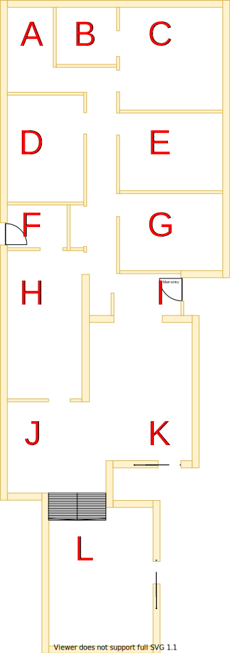
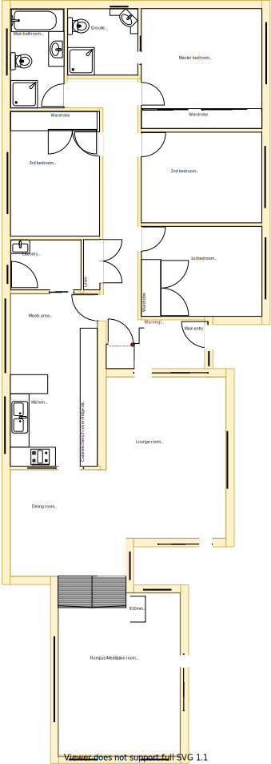
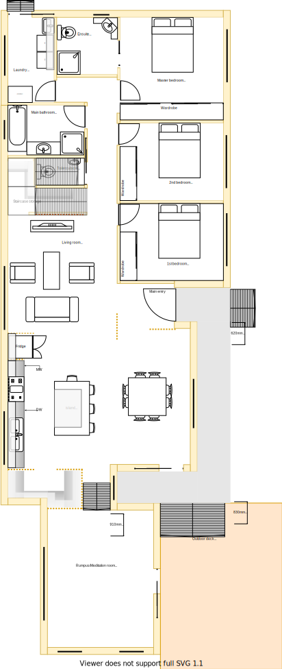

# Lower-Level Requirements

The lower-level refers to the entire building structure that is directly connected to the ground. 

In the first diagram ine the below table below, "Actual" view represents the current house's room floor plan mapped with section labels. The "Expected" view represents how some rooms have been repurposed, moved or merged. With these transformations we will use section labels which represent regions as the basis for analysing comparisons to quote the scope of work on.

|Actual|Expected|
|:---:|:---:|
|||

Table LL1: Layout comparison

Table LL1 outlines the two views side by side highlighting that all of the structural changes to walls are mostly on the west side of the house (refer to sections between: D, F, H, I,  J & K). 

I have deliberately tried to reduce the number of structural changes in order to reduce the overrall costs.

Note, that a stair case has also been modeled to ensure that quote accouts for this structural change to.

Use the following diagrams in Table LL2 (see below) to get an overall visualisation of the floor plan in sections outlined.

|Actual|Expected|
|:---:|:---:|
|||

Table LL2: Floor plan comparison

Using the above diagrams as a guide, visit each link in the Lower-Level Section Requirements table below to assess the complete set of requirements for the lower-level.

|Section Group|Was|Will be|
|:---|:---|:---|
|[Section A](./section-A-requirements.md)|Main Bathroom|Laundry|
|[Section B](./section-B-requirements.md)|Ensuite|Ensuite|
|[Section C](./section-C-requirements.md)|Master bedroom|Master bedroom|
|[Section DF](./section-DF-requirements.md)|3rd bedroom|Bathroom & multi-level stairs|
|[Section E](./section-E-requirements.md)|Study|2nd bedroom|
|[Section G](./section-G-requirements.md)|1st bedroom|1st bedroom|
|[Section H](./section-H-requirements.md)|Laundry, meals area and kitchen|Enlarged kitchen|
|[Section I](./section-I-requirements.md)|Main entrance and hall passage|Main entrance and hall passage|
|[Section J](./section-J-requirements.md)|Dining room|Dining room|
|[Section K](./section-K-requirements.md)|Lounge room|Lounge room|
|[Section L](./section-L-requirements.md)|Rumpus room|Rumpus room|

Table LL3: Lower-Level Section Requirements