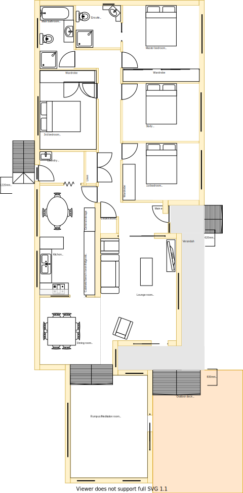
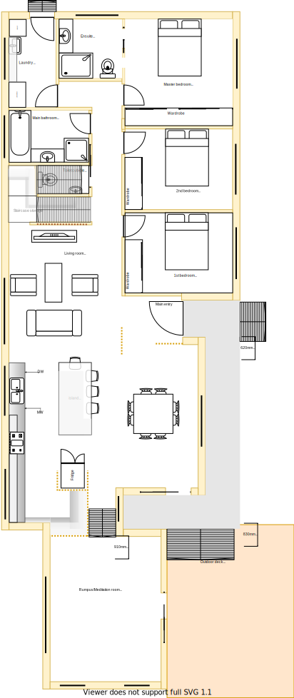

# Lower-Level Requirements

The Lower-Level refers to the entire building structure that is directly connected to the ground. 

In the AS-IS model there is a direct 1-to-1 mapping between room (defined by walls) and sections. However, in the TO-BE model some rooms have been repurposed, moved or merged and therefore room references are not appropriate to use as the basis for analysing comparisons to quote a scope of work on.

Thus, rather than using room names, section groups have been used as the basis of organising the requirements. In this way each room in the AS-IS house floor plan has been assigned an alpabetical section identifier and one or more affected sections will be organised together. 

|As-is wall model| To-be wall model|
|---|---|
|||

Table LL1: AS-IS & TO-BE wall/section model comparison

Table LL1 outlines two diagrams side by side highlighting that all of the structural changes to walls are on the west side of the wall section plan (including sections between: D, F, H, I & J). 

I deliberately tried to reduce the number of structural changes in orderto reduce costs.

Note, that a staircase has also been modeled to ensure that quote accouts for this structural change to.

Use the following diagrams in Table LL2 (see below) to get an overall visualisation of the sections outlined.

|As-is floor plan model| To-be floor plan model|
|---|---|
|||

Table LL2: AS-IS & TO-BE floor plan comparison

Using the above diagrams as a guide, visit each link in the Section Requirements table below to assess the complete set of requirements for the lower-level.

|Section Group| AS-IS (Original) | TO-BE (Planned)|
|---|---|---|
|[Section A](./section-A-requirements.md)|Main Bathroom|Laundry|
|[Section B](./section-B-requirements.md)|Ensuite|Ensuite|
|[Section C](./section-C-requirements.md)|Master bedroom|Master bedroom|
|[Section DF](./section-DF-requirements.md)|3rd bedroom|Bathroom & multi-level stairs|
|[Section E](./section-E-requirements.md)|Study|2nd bedroom|
|[Section G](./section-G-requirements.md)|1st bedroom|1st bedroom|
|[Section H](./section-H-requirements.md)|Laundry, meals area and kitchen|Enlarged kitchen|
|[Section I](./section-I-requirements.md)|Main entrance and hall passage|Main entrance and hall passage|
|[Section J](./section-J-requirements.md)|Dining room|Dining room|
|[Section K](./section-K-requirements.md)|Lounge room|Lounge room|
|[Section L](./section-L-requirements.md)|Rumpus room|Rumpus room|
