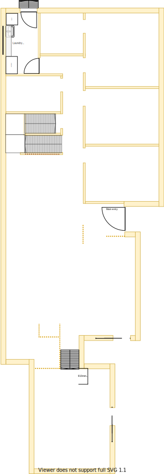

# Section A

## Context
Section A was the Main bathroom in the original floor plan.

Figure LL2: TO-BE lower-level sections

There is/are:
* A single downlight installed
* A ducted heating outlet
* No better ideal backdoor/outdoor exit point at ground level than on the north wall in this room  

## Problem
1. Refer to [laundry related problems](./section-H-requirements.md#Problem) that are captured in section H
2. Visitors would need to navigate to the far end of the house to go to the bathroom

## Solution
1. Move the [laundry](./section-H-requirements.md) to this location and, move the [main bathroom](./section-DF-requirements.md) beside this
2. Move the back door such that it is now a single step outside to level ground beside the clothes line  

|As-is section A model| To-be section A model|
|---|---|
|||

Table LL-A1: AS-IS & TO-BE section A model comparison

## Requirements

|ID|Description|Est. Cost|Additinal Preference Cost|
|---|---|---|---|
|LLA-REQ1|Remove bathroom fixtures|||
|LLA-REQ2|Re-tile floor where required|||
|LLA-REQ3|Install laundry sink|||
|LLA-REQ4|Install linen cabinet|||
|LLA-REQ5|Install door to access outside|||
|LLA-REQ6|Replace window & frame with double glazzed product|||
|LLA-REQ7|Repaint|||
|LLA-REQ8|Replace door handle|||
|LLA-REQ9|Replace ducted heating vent|||
|LLA-REQ10|Install hot & cold water outlets for washing machine|||
|LLA-REQ11|Install powerpoint outlets for washing machine and dryer|||
|LLA-REQ12|Install downlight to outside area|||

## Known issues

|ID|Description|
|---|---|
|LLA-ISS-1|Outside tap will need to be re-located as it is installed on the north wall brickwork and will be affected by LLA-REQ5|  

## Preferences
1. Sliding doors are preferable to standard doors as they take better advantage of space
2. Ceramic washer taps are prefereable to standard washer taps for ease of maintenace 
3. If you guys think that the some laundry/bathroom fixtures can be refurbished to newish condition to reduce costs then please advise me?
