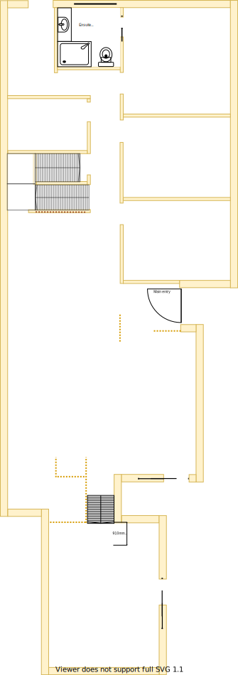

# Section B - Ensuite for the master bedroom

## Context

Section B remains as the master bedroom's ensuite on the lower level.

Figure LL2: Expected layout

There is/are currently:
* An exhaust fan with 4 heat lamps and a central LED bulb built in
* A single LED downlight  
* A set of fixtures: shower, toilet, sink, cabinet & mirror
* The floor is currently tiled  

## Problem

1. The ensuite is old and has had mold on the ceiling
2. There is no ducted heating outlet installed and heating is achieved using an electric heater and/or the exhaust fan's heat lamps
3. The sliding door constantly bumps up against the inner enclosure when the wind blows
4. Inequity will arise if there are differences in size, quality and positioning between upper and lower levels

## Solution

1. Keep ensuite in Section B because of the following principles:
    * Embrace value for money first, but select premium if just 20% more than standard pricing
        - Minimising structural changes will reduce costs
    * Symmetry with split occupancy
        - Equal equity whether on upper or lower levels
    * Rooms/resources that are used together should be adjacent to one another
        - Ensuite is expected to reside adjoining master bedroom
    * Rooms/resources that are frequented in terms of time spent/people should attract more space/investment than others
2. Choose appliances and fixtures that satisfy the following principles in order:
    1. Symmetry with split occupancy 
        - Same quality and fittings whether on upper or lower levels 
    2. Embrace value for money first, but select premium if just 20% more than standard pricing
    3. No maintenance over low/some maintenance

|Actual|Expected|
|:---:|:---:|
|||

Table LL-B1: Floor plan comparison

## Symmetric Requirements

|ID|Description|Est. Cost|Alternative Solution Cost|
|:---|:---|:---|:---|
|LLB-REQ1|The bathroom must have an LED downlight|||
|LLB-REQ2|The bathroom must have a sink with ceramic washer taps|||
|LLB-REQ3|The bathroom must have a toilet|||
|LLB-REQ4|The bathroom must have a cabinet|||
|LLB-REQ5|The bathroom must have heat lamps|||
|LLB-REQ6|The bathroom must have a shower with ceramic washer taps|||
|LLB-REQ7|The bathroom must have a mirror|||
|LLB-REQ8|The bathroom must have a bathtub with ceramic washer taps|||
|LLB-REQ9|The bathroom must have an exhaust fan|||
|LLB-REQ10|The bathroom must be connected to the ducted heating|||
|LLB-REQ11|The bathroom must have an appropriately sized double glazzed window to embrace natural lighting and reduce demand on heating/cooling|||
|LLB-REQ12|The bathroom window must be able to be opened for ventilation|||
|LLB-REQ13|The bathroom window must have a fly screen to keep the insects out|||
|LLB-REQ14|The bathroom must have a fitted night/day internal roller blind with sun/heat block|||
|LLB-REQ15|The bathroom's floor must be tiled|||
|LLB-REQ16|The bathroom must have power outlets appropriately positioned|||
|LLB-REQ17|The same appliance/fixtures must have been installed in the same positions as the other ensuite|||

## Refurbishing Requirements

|ID|Description|Est. Cost|Alternative Solution Cost|
|:---|:---|:---|:---|
|LLB-REQ1|Refurbish existing appliances/fixtures if equivalent & no loss in quality between upper and lower levels|||
|LLB-REQ2|The outside external ensuite wall must have a multi-socket power point installed to give power to the shed and carport|||

## Known issues

|ID|Description|
|:---|:---|
|LLB-ISS-1|The bathroom is prone to acculating mold on the ceiling||
|LLC-ISS-2|The current exhaust fan with a slightly open window is not very effective at removing the mist after a hot shower||

