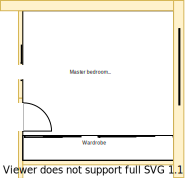
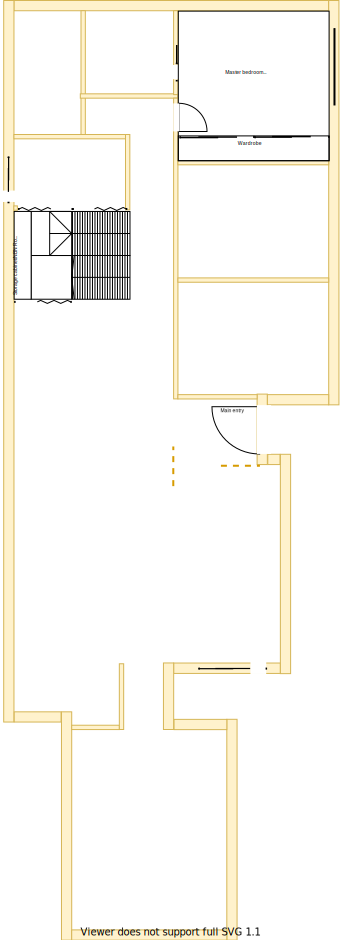

# Section C - Master bedroom

## Context

Section C remains as the master bedroom on the lower level.

Figure LL2: Expected layout

There is/are currently:
* Three downlights installed centrally
* An extra unused exhaust fan switch on the wall entrance to the ensuite
* A Broken door stopper
* A ducted heating vent beside the east window  
* An external window blind to the east of the window
* Sheer and bulky pinch pleated curtains with thermo insulation lining
* An active UHF TV antenna port on the south east corner wall by the wardrobe is connected to the external antenna

## Problem

1. The wardrobe is built into the wall and is bulky with unnecessary plasterboard coverings
2. The wardrobe sliders are very heavy and keep jumping off their rails
3. The wardrobe draws are overly worn and no longer stay on their rails
4. The wardrobe plastic shelve coverings have fallen off 
5. There is no cooling system in this room
6. The current window frames are old, large and difficult to open behind the fly screen
7. The curtains are heavy and cumbersome to operate
8. Inequity will arise if there are differences in size, quality and positioning between upper and lower levels

## Solution

1. Keep the master bedroom in Section C because of the following principles:
    * Embrace value for money first, but select premium if just 20% more than standard pricing
        - Minimising structural changes will reduce costs
    * Symmetry with split occupancy
        - Equally equitable whether on the upper or lower levels
    * Reduce overall transit as the basis of location
        - Close proximity to all resources
    * Rooms/resources that are used together should be adjacent to one another
        - Close proximity to stairs, and study
    * Rooms/resources that are frequented in terms of time spent/people should attract more space/investment than others
3. Choose appliances and fixtures that satisfy the following principles in order:
    1. Symmetry with split occupancy 
        - Same quality and fittings whether on upper or lower levels 
    2. Embrace value for money first, but select premium if just 20% more than standard pricing
    3. No maintenance over low/some maintenance

|Actual|Expected|
|:---:|:---:|
|||

Table LL-C1: Floor plan comparison

## Symmetric Requirements

|ID|Description|Est. Cost|Alternative Solution Cost|
|:---|:---|:---|:---|
|LLC-REQ1|The bedroom must have an efficient/effective wardrobe that maximises space|||
|LLC-REQ2|The bedroom must have an appropriate number of LED downlights|||
|LLC-REQ3|The bedroom must have a UHF TV port socket installed and connected to the external aerial|||
|LLC-REQ4|The bedroom must be carpeted|||
|LLC-REQ5|The bedroom must have an appropriately sized double glazzed window|||
|LLC-REQ6|The bedroom must have a ducted heating vent|||
|LLC-REQ7|The bedroom must have a fitted night/day internal roller blind with sun/heat block|||
|LLC-REQ8|The bedroom must have power outlets appropriately positioned on the north east, north west and south east sides|||
|LLC-REQ9|The bedroom must have a centrally installed ceiling fan|||
|LLC-REQ10|The same appliance/fixtures must have been installed in the same positions as the other master bedroom|||

## Refurbishing Requirements

|ID|Description|Est. Cost|Alternative Solution Cost|
|:---|:---|:---|:---|
|LLC-REQ11|Refurbish existing appliances/fixtures if equivalent & no loss in quality between upper and lower levels|||
|LLC-REQ12|Remove external window blind|||

## Known issues

|ID|Description|
|:---|:---|
|LLC-ISS-1|Brett to advice how window/frame consistency can be achieved between levels|
|LLC-ISS-2|The choice of wardrobe and size may affect the suitability of the existing TV antenna port|

## Preferences

1. There should be one large full size mirror available on each level