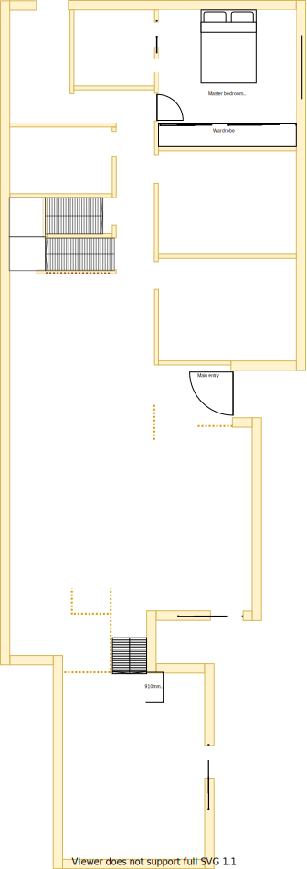

# Section C - Master bedroom

## Context

Section C remains as the master bedroom on the lower level.

Figure LL2: Expected layout

There is/are currently:
* Three downlights installed centrally
* An extra unused switch on the wall entrance to the ensuite for the exhaust fan
* A broken door stopper
* A ducted heating vent beside the east window  
* An external window blind to the east of the window
* Sheer and bulky pinch pleated curtains with thermo insulation lining
* An active UHF TV antenna port on the south east corner wall by the wardrobe is connected to the external antenna

## Problem

1. The wardrobe is built into the wall and is bulky with unnecessary plasterboard coverings
2. The wardrobe sliders are very heavy and keep jumping off their rails
3. The wardrobe draws are overly worn and no longer stay on their rails
4. The wardrobe plastic shelve coverings have fallen off 
5. There is no cooling system in this room
6. The current window frames are old, large and difficult to open behind the fly screen
7. The curtains are heavy and cumbersome to operate

## Symmetric Requirements

|ID|Description|Est. Cost|Alternative Solution Cost|
|:---|:---|:---|:---|
|LLC-REQ1|The bedroom shall have an efficient/effective wardrobe that maximises space|||
|LLC-REQ2|The bedroom shall have an appropriate number of LED downlights appropriately positioned|||
|LLC-REQ3|The bedroom shall have a UHF TV port socket installed and connected to the external aerial|||
|LLC-REQ4|The bedroom shall be carpeted|||
|LLC-REQ5|The bedroom shall have an appropriately sized double glazed window|||
|LLC-REQ6**|The bedroom shall have a ducted heating vent|||
|LLC-REQ7|The bedroom shall have a fitted night/day internal roller blind with sun/heat block|||
|LLC-REQ8|The bedroom shall have power outlets appropriately positioned on the north east, north west and south east sides|||
|LLC-REQ9**|The bedroom shall have a centrally installed ceiling fan|||
|LLC-REQ10|The same appliance/fixtures shall have been installed in the same positions as the other master bedroom|||

## Refurbishing Requirements

|ID|Description|Est. Cost|Alternative Solution Cost|
|:---|:---|:---|:---|
|LLC-REQ11|The master bedroom shall be refurbished to as new condition|||
|LLC-REQ12|The master bedroom's external window blind shall be removed|||

** - Optional requirement which may prove unnecessary given the situation

## Solution

|Actual|Expected|
|:---:|:---:|
|||

Table LL-C1: Floor plan comparison

Note, although the master bedroom will remain the same size, the furnishing sizes may vary and they need not remain the same (eg. window frame size or wardrobe)

### Steps
1. Refurbish master bedroom in line with upper-level and the rest of the house  

|Design principles|
|:---|
|Embrace value for money first, but select premium if just 20% more than standard pricing|
|No maintenance over low/some maintenance|
|Reduce overall transit as the basis of location|
|Rooms/resources that are used together should be adjacent to one another|
|Rooms/resources that are frequented in terms of time spent/people should attract more space/investment than others|

### Considerations

1. LLC-REQ6 & LLC-REQ9
    - Subject to the decision on centralised heating & cooling option selected

## Known issues

|ID|Description|
|:---|:---|
|LLC-ISS-1|Brett to advice how window/frame consistency can be achieved between levels|
|LLC-ISS-2|The choice of wardrobe and size may affect the suitability of the existing TV antenna port|

## Photos

Photo: LSC-photo-1 - Bulky wardrobe

Photo: LSC-photo-2 - Full size window frame with external window blind

## References

1. Ikea
    - https://www.ikea.com/au/en/p/elvarli-5-sections-white-bamboo-s79302896/
    - https://www.ikea.com/au/en/p/nissedal-mirror-white-10320322/
2. Carpet Tiles 1
    - https://www.carpettiles1.com.au/carpet-tiles/product-details/matin-dark-tan-brown--model:cpt-393