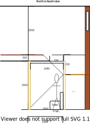

# Section D - Lower-level bathroom and Multi-level staircase

## Context

Section D was originally the 3rd bedroom that was situated south of the original bathroom location.

Figure LL2: Expected layout

There is/are currently:
* Carpeted flooring
* Two downlights installed that operate through a dimmer transformer
* Two bedside lamps, one on the east wall and the other on the west wall
* A bulky wardrobe with a built-in desk with shelves beside the wardrobe  
* A ducted heating vent by the north west wall
* A semi full-length old style window frame that matches the [window framing in the kitchen](./section-H-requirements.md)
* An external window blind to the west of the room
* Sheer and bulky pinch pleated curtains with thermo insulation lining

## Problem

1. There is a need for a central multi-level staircase in the new house design for conveniently navigating between floors and rooms in the house
2. The original room's built-in wardrobe & desk with shelves are bulky
3. The original room's wardrobe reduces the effective space of the room when opening and also conflicts with the room's entrance door
4. The room's door handle is completely broken 
5. There is no cooling system in this room
6. The current window frames are old, large and difficult to open behind the fly screen
7. The curtains are heavy and cumbersome to operate
8. Visitors would need to navigate to the far end of the house to go to the bathroom

## Bathroom Requirements

|ID|Description|Est. Cost|Alternative Solution Cost|
|:---|:---|:---|:---|
|LLD-REQ1|The bathroom shall have an LED downlight|||
|LLD-REQ2|The bathroom shall have a sink with ceramic washer taps|||
|LLD-REQ3|The bathroom shall have an independent cubical toilet|||
|LLD-REQ4|The bathroom shall have a cabinet|||
|LLD-REQ5|The bathroom shall have heat lamps|||
|LLD-REQ6|The bathroom shall have a shower with ceramic washer taps|||
|LLD-REQ7|The bathroom shall have a mirror|||
|LLD-REQ8|The bathroom shall have a bathtub with ceramic washer taps|||
|LLD-REQ9|The bathroom shall have an exhaust fan|||
|LLD-REQ10|The ducted heating vent shall be re-allocated to a bedroom on the upper level|||
|LLD-REQ11|The bathroom shall have an appropriately sized double glazed window to embrace natural lighting and reduce demand on heating/cooling|||
|LLD-REQ12|The bathroom window shall be able to be opened for ventilation|||
|LLD-REQ13|The bathroom window shall have a fly screen to keep the insects out|||
|LLD-REQ14**|The bathroom shall have a fitted night/day internal roller blind with sun/heat block. (dependent on the effectiveness of the double glazzed windows)|||
|LLD-REQ15|The bathroom's floor shall be tiled|||
|LLD-REQ16|The bathroom shall have power outlets appropriately positioned|||
|LLD-REQ17|The same appliance/fixtures shall have been installed in the shared bathroom on the upper-level|||
|LLD-REQ30|All bathroom entry doors shall be able to be secured with a lock|||

## Staircase Requirements

|ID|Description|Est. Cost|Alternative Solution Cost|
|:---|:---|:---|:---|
|LLD-REQ18|The staircase shall have a high raised platform providing walk in access to storage shelves|||
|LLD-REQ20|The ducted heating vent shall be relocated to an upper-level bedroom|||
|LLD-REQ21|The staircase and hall flooring shall be replaced and consistent across all wet areas|||
|LLD-REQ22|The staircase shall not be bulky|||
|LLD-REQ24|The staircase's area shall have a powerpoint outlet near by the platform|||
|LLD-REQ25|The staircase's area shall host the NBN HFC Coaxial port and bracket, NBN modem and WIFI by the platform|||
|LLD-REQ26|The staircase area shall have a double glazed window and frame above the cabinet for the top level only|||
|LLD-REQ27|The staircase area's window shall have fitted night/day internal roller blind with sun/heat block with rollers accessible from the platform|||
|LLD-REQ29|The external window blind shall be removed|||

## Solution

|Actual|Expected|
|:---:|:---:|
|||

Table LL-D1: Floor plan comparison

Figure LL-D2: Staircase sideview 

|Design principles|
|:---|
|Embrace value for money first, but select premium if just 20% more than standard pricing|
|Fixtures and furnishings value function over form|
|No maintenance over low/some maintenance|
|Rooms/resources that are used together should be adjacent to one another|
|Reduce overall transit as the basis of location|
|Embrace natural lighting and reduce demand on heating/cooling systems|

Table LL-D2: The design principles that should be influencing the solution's location/choices/decisions

### Steps

1. Partition the room into the following to provide:
    1. The bathroom
    2. An independent toilet
    3. The multi-level staircase

### Considerations

1. LLD-REQ20
    - Subject to the decision on centralised heating & cooling option selected
2. Building Code Ceiling Heights
    - in a bathroom, shower room, laundry, sanitary compartment, pantry, storeroom, garage, car parking area etc - 2.1m and
    - in an attic, room with a sloping ceiling or projection below ceiling line or non-habitable room or similar - a height that does not unduly interfere with the proper functioning of the room or space. More than 50% of the ceiling space should be on average a minimum height.

## Known issues

|ID|Description|
|:---|:---|
|LLD-ISS-1|A large portion of the original large bedroom's window will need to be filled with rendered cladded foam. This will probably look very jarring from the outside|
|LLD-ISS-2|There are min height requirements that must be satisfied for a room with a slopping ceiling|

## Photos

Photo: LLD-photo-1 - Window outside section D with external blind

Photo: LLD-photo-2 - Built-in wardrobe where shower is to be placed

Photo: LSD-photo-3 - north west external wall

Photo: LSD-photo-4 - north west external plumbing

## References

1. Bunnings
    - https://www.bunnings.com.au/caroma-luna-hand-wall-basin-1-tap-hole_p0118509
    - https://www.bunnings.com.au/estilo-90-x-90-x-190cm-white-acrylic-shower-wall_p4890678
    - https://www.bunnings.com.au/mondella-rococo-shower-screen-chrome_p0036480
    - https://www.bunnings.com.au/mondella-wels-3-star-9l-min-rococo-1-function-rail-shower_p5003327
    - https://www.bunnings.com.au/methven-arrow-shower-mixer_p0057004
    - https://www.bunnings.com.au/mondella-900mm-white-square-resonance-shower-base_p4890568
    - https://www.bunnings.com.au/caroma-wels-4-star-3-5l-min-luna-cleanflush-toilet-suite_p0088812
    - https://www.bunnings.com.au/cibo-design-white-vivid-ceramic-square-counter-top-basin_p4822164
    - https://www.bunnings.com.au/caroma-wels-5-star-6l-min-luna-mid-basin-mixer_p0131571
    - https://www.bunnings.com.au/cibo-design-750mm-white-tonic-full-height-vanity_p0138265
    - https://www.bunnings.com.au/estilo-765mm-metal-shaving-cabinet_p4823199
    - https://www.bunnings.com.au/caroma-600mm-chrome-double-towel-rail_p4820139
    - https://www.bunnings.com.au/caroma-200mm-polished-chrome-cosmo-hand-towel-rail_p4820141
    - https://www.bunnings.com.au/johnson-tiles-500-x-500mm-white-jura-stone-gloss-ceramic-floor-tile-4-pack_p6661693
    - https://www.bunnings.com.au/stylus-1675mm-origin-bath_p4821597
    - https://www.bunnings.com.au/caroma-240mm-chrome-saracom-bath-wall-mixer_p5002670

2. Burdens
    - https://burdensbathrooms.com.au/collections/showers-all-ranges/products/oceano-stonelite-eco-base-900-x-900-rear-outlet-chrome-waste
    - https://burdensbathrooms.com.au/collections/showers-all-ranges/products/aspire-zodiac-ii-chrome-lever-shower-set-cl2034
    - https://burdensbathrooms.com.au/collections/showers-all-ranges/products/oceano-louve-square-pivot-return-screen-900-x-2000-chrome
    - https://burdensbathrooms.com.au/collections/toilets/products/matisse-ii-round-back-to-wall-suite
    - https://burdensbathrooms.com.au/collections/vanities-1/products/aspire-unity-ii-900-vanity-floor-1th-c-w-sq-ceramic-top-whit-rh-d
    - https://burdensbathrooms.com.au/collections/bathroom-tapware/products/millennium-kiato-basin-mixer-chrome
    - https://burdensbathrooms.com.au/collections/mirrors-shaving-cabinets/products/fienza-bevelled-edge-mirror-600-x-750
    - https://burdensbathrooms.com.au/collections/bathroom-accessories/products/aspire-unity-round-single-towel-rail-800mm-chrome-23801
    - https://burdensbathrooms.com.au/collections/bathroom-accessories/products/aspire-zodiac-guest-towel-holder-chrome
    - https://burdensbathrooms.com.au/collections/baths-spa-s/products/oceano-urban-inset-bath-1525-x-800-x-470-white-anti-slip
    - https://burdensbathrooms.com.au/collections/bath-tapware-outlets/products/aspire-zodiac-ii-chrome-bath-set-tp1475

3. Building Code Ceiling Heights
    - https://www.abis.com.au/habitable-room-and-legal-ceiling-heights#:~:text=Building%20Code%20Ceiling%20Heights&text=in%20a%20habitable%20room%20excluding,area%20etc%20%2D%202.1m%20and