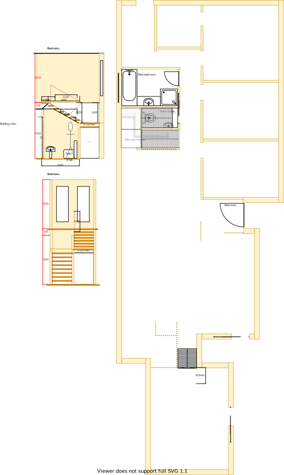

# Section DF - Laundry and Multi-level stair case [shared resource]

## Context

Section DF was originally the 3rd bedroom that was situated beside south of the original bathroom location.

Figure LL2: Expected layout

There is/are currently:
* Carpeted flooring
* Two downlights installed that operate through a dimmer transformer
* Two bedside lamps, one on the east wall and the other on the west wall
* A bulky wardrobe with a built-in study desk with shelves beside the wardrobe  
* A ducted heating vent by the north west wall
* A semi full-length old style window frame that matches the [window framing in the kitchen](./section-H-requirements.md)
* An external window blind to the west of the room
* Sheer and bulky pinch pleated curtains with thermo insulation lining

## Problem

1. There is a need for a central multi-level stair case in the new house design for conveniently navigating between floors and rooms in the house
2. The original room's built-in wardrobe & desk with shelves are bulky
3. The original room's wardrobe reduces the effective space of the room when opening and also conflicts with the room's entrance door
4. The room's door handle is completely broken 
5. There is no cooling system in this room
6. The current window frames are old, large and difficult to open behind the fly screen
7. The curtains are heavy and cumbersome to operate

## Symmetric Requirements

|ID|Description|Est. Cost|Alternative Solution Cost|
|:---|:---|:---|:---|
|LLDF-REQ1|The laundry shall have an LED downlight|||
|LLDF-REQ2|The laundry shall have a laundry sink with ceramic washer taps|||
|LLDF-REQ3|The laundry shall have a cleaning products cabinet with an overhead cabinet|||
|LLDF-REQ4**|The laundry shall be connected to the ducted heating|||
|LLDF-REQ5|The laundry shall have an appropriately sized double glazed window to embrace natural lighting and reduce demand on heating/cooling|||
|LLDF-REQ6|The laundry window shall be able to be opened for ventilation|||
|LLDF-REQ7|The laundry window shall have a fly screen to keep the insects out|||
|LLDF-REQ8|The laundry shall have a fitted night/day internal roller blind with sun/heat block|||
|LLDF-REQ9|The laundry's floor shall be tiled|||
|LLDF-REQ10|The laundry shall have hot & cold water outlets for the washer|||
|LLDF-REQ11|The laundry shall have power outlets appropriately positioned for washer, dryer, iron|||
|LLDF-REQ12|The laundry shall have a linen cabinet that maximises space and storage space for iron board|||
|LLDF-REQ13|The laundry shall have a sliding door access to clothes line outside|||
|LLDF-REQ14|The laundry shall have a downlight to the outside area|||
|LLDF-REQ15|In winter, the laundry shall be able to bottle heat in the enclosed space to dry clothes on a drying rack|||
|LLDF-REQ16|The laundry shall be refurbished to as new condition|||

## New/Refurbishing Requirements

|ID|Description|Est. Cost|Alternative Solution Cost|
|:---|:---|:---|:---|
|LLDF-REQ18|The laundry shall have an accordion door to south side against multi-level stair case to access the storage under the stair case. Note, the stair case shall also have a small accordion door on the south side too|||
|LLDF-REQ19|The laundry wall shall now be extend along the north east and the door frame moved to accommodate a linen cabinet|||
|LLDF-REQ20**|The ducted heating vent shall be relocated to an appropriate position in the laundry|||
|LLDF-REQ21|The stair case and hall flooring shall be replaced and consistent across all wet areas|||
|LLDF-REQ22|The stair case shall not be bulky|||
|LLDF-REQ23|The stair case's central platform shall host a shared storage cabinet|||
|LLDF-REQ24|The stair case's area shall have a powerpoint outlet near storage cabinet|||
|LLDF-REQ25|The stair case's area shall host the NBN HFC Coaxial port and bracket, NBN modem and WIFI above storage cabinet|||
|LLDF-REQ26|The stair case area shall have a double glazed window and frame above the cabinet for the top level only|||
|LLDF-REQ27|The stair case area's window shall have fitted night/day internal roller blind with sun/heat block|||
|LLDF-REQ28|The laundry and stair shall be refurbished to as new condition|||
|LLDF-REQ29|The external window blind shall be removed|||

## Solution

|Actual|Expected|
|:---:|:---:|
|||

Table LL-DF1: Floor plan comparison

|Design principles|
|:---|
|Reduce overall transit as the basis of location|
|Embrace natural lighting and reduce demand on heating/cooling systems|
|Embrace value for money first, but select premium if just 20% more than standard pricing|
|No maintenance over low/some maintenance|

Table LL-DF2: The design principles that should be influencing the solution's location/choices/decisions

### Steps

1. Partition the room into two to provide:
    1. The laundry 
    2. The multi-level stair case
2. Relocate the laundry in section DF 

### Considerations

1. LLDF-REQ20
    - Subject to the decision on centralised heating & cooling option selected

## Known issues

|ID|Description|
|:---|:---|
|LLDF-ISS-1|A large portion of the original large bedroom's window will need to be filled with rendered cladded foam. This will probably look very jarring from the outside|

## Photos

Photo: LLDF-photo-1 - Window outside section DF with external blind

Photo: LLDF-photo-1 - Built-in wardrobe where shower is to be placed
