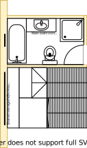

# Section DF

## Context

Section DF was the 3rd bedroom in the lower level as per the original floor plan.

Figure LL2: TO-BE lower-level sections

There is/are:
* Two downlights installed that operate through a dimmer transformer
* Two bedside lamps, one on the east wall and the other on the west wall
* A bulky wardrobe with a built-in study desk with shelves beside the wardrobe  
* A ducted heating vent by the north west wall
* A semi full-length old style window frame to match the [window framing in the kitchen](./section-H-requirements.md)
* An external blind to the west of the room
* Sheer and bulky pinch pleated curtains with thermo insulation lining

## Problem

1. There is a need in the new lower/upper-level house design for a central area that can conveniently and intuitively be navigated between levels and rooms in the house
2. The built-in wardrobe & desk with shelves is bulky
3. The wardrobe reduces the effective space of the room when opening and also conflict with the room entrance door
4. The room door handle is completely broken 
5. There is no cooling system in this room
6. The current window frames are old, large and difficult to open behind the fly screen
7. The curtains are heavy and cumbersome to operate

## Solution

1. Partition room into two:
    1. The main bathroom as identical to the corresponding main bathroom in the upper level
    2. The multi-level accss staircase

|As-is Section DF model| To-be Section DF model|
|:---:|:---:|
|||

Table LL-DF1: AS-IS & TO-BE Section DF model comparison

## Requirements

|ID|Description|Est. Cost|Alternative Solution Cost|
|:---|:---|:---|:---|
|LLDF-REQ1|Remove all room building fixtures|||
|LLDF-REQ2|Remove carpet|||
|LLDF-REQ3|Install bathroom south wall|||
|LLDF-REQ4|Install bathroom window & frame|||
|LLDF-REQ5|Install exhaust fan and heat lamps|||
|LLDF-REQ6|Remove one downlight and relocate the other centrally if required|||
|LLDF-REQ7|Extend north east wall and move door frame to accomodate shower|||
|LLDF-REQ8|Move ducted heating vent to appropriate position|||
|LLDF-REQ9|Tile bathroom floor|||
|LLDF-REQ10|Install all of the same main bathroom furnishings as the upper level|||
|LLDF-REQ11|Install powerpoint outlet near sink|||
|LLDF-REQ12|Tile staircase floor|||
|LLDF-REQ13|Install staircase|||
|LLDF-REQ14|Install shared storage cabinet|||
|LLDF-REQ15|Install powerpoint outlet near storage cabinet|||
|LLDF-REQ16|Relocate NBN HFC Coaxial port and bracket, NBN modem and WIFI above storage cabinet|||
|LLDF-REQ17|Install double glazzed window and frames above staircase cabinet|||
|LLDF-REQ18|Install fitted night/day blinds staircase with blind pulleys accessible from central staircase platform|||
|LLA-REQ19|Repaint both areas|||
|LLA-REQ20|Remove external window blind|||

## Known issues

|ID|Description|
|:---|:---|
|LLDF-ISS-1|The original [main bathroom](./section-A-requirements.md) is larger than this modeled main bathroom|
|LLDF-ISS-2|A large portion of the original large bedroom window will need to be filled with rendered cladded foam. This will probably look very jarring from the outside|

## Preferences

1. Ceramic washer taps are prefereable to standard washer taps for ease of maintenace 