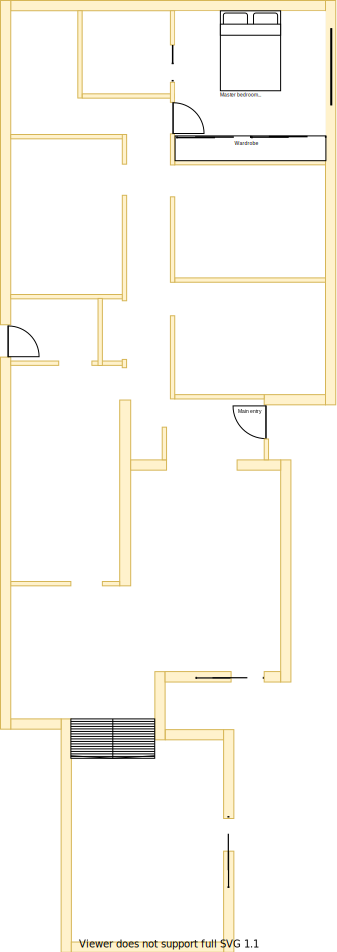

# TODO Section C

## Context
Section C remains as the Master Bedroom's ensuite in the lower level as per the original floor plan.

## Problem
1. My 84 year old dad will be moving into this room and we wanted to ensure that he was given a modern room
2. The wardrobe is bolky with unnecessary plasterboard covering access
3. The wardrobe sliders are very heavy and keep jumping off their rails
4. The wardrobe draws are overly worn and no longer stay on their rails
5. The wardrobe plastic shelve coverings have fallen off 
6. There is no cooling system in this room
7. The current window frames are old, large and difficult to open behind the fly screen

## Solution
1. Renew the entire master bedroom and make it identical to the corresponding Upper Level master bedroom

|As-is Section C model| To-be Section C model|
|---|---|
|||
Table LL-B1: AS-IS & TO-BE Section C model comparison

## Requirements
|ID|Description|Est. Cost|Additinal Preference Cost|
|---|---|---|--|
|LLC-REQ1|Replace carpet||
|LLC-REQ2|Replace wardrobe||
|LLC-REQ3|Replace door handle||
|LLC-REQ4|Replace window & frame with double glazzed product||
|LLC-REQ5|Replace curtains with fitted night/day blinds||
|LLC-REQ6|Replace powerpoints outlets with more sockets||
|LLA-REQ7|Repaint||
|LLA-REQ8|Install ceiling fan||
|LLA-REQ9|Replace ducted heating vent||

## Known issues
|ID|Description|
|---|---|
|LLC-ISS-1|There is an UHF TV antenna port in the south east corner by the wardrobe already installed. The choice of wardrobe may affect the suitability of this location|

## Preferences
1. Wardrobes with a fullsize mirror installed on a sliding door has been useful