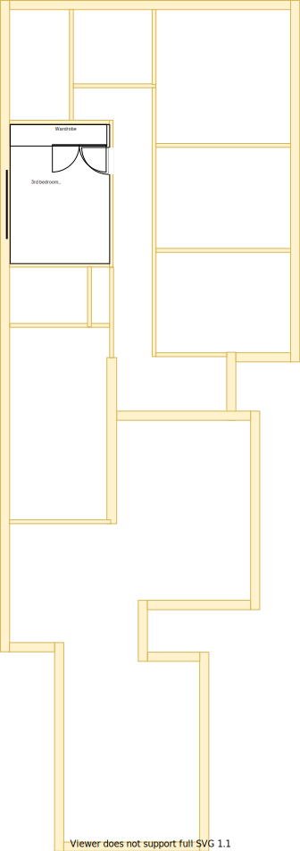
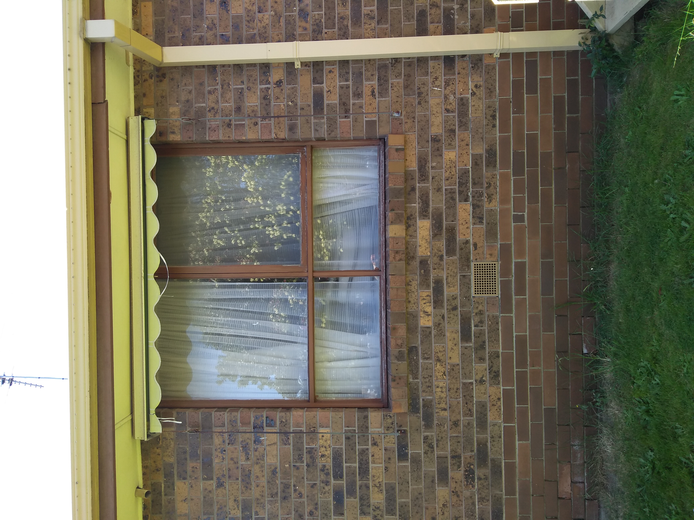

# Section DF - Main bathroom and Multi-level stair case

## Context

Section DF was originally the 3rd bedroom that was closest to the original bathroom. The new bathroom will now be relocated here in a slightly more accessible location.

Figure LL2: Expected layout

There is/are currently:
* Carpeted flooring
* Two downlights installed that operate through a dimmer transformer
* Two bedside lamps, one on the east wall and the other on the west wall
* A bulky wardrobe with a built-in study desk with shelves beside the wardrobe  
* A ducted heating vent by the north west wall
* A semi full-length old style window frame that matches the [window framing in the kitchen](./section-H-requirements.md)
* An external window blind to the west of the room
* Sheer and bulky pinch pleated curtains with thermo insulation lining

## Problem

1. There is a need for a central multi-level stair case in the new house design for conveniently navigating between floors and rooms in the house
2. The original room's built-in wardrobe & desk with shelves is bulky
3. The original room's wardrobe reduces the effective space of the room when opening and also conflicts with the room's entrance door
4. The room's door handle is completely broken 
5. There is no cooling system in this room
6. The current window frames are old, large and difficult to open behind the fly screen
7. The curtains are heavy and cumbersome to operate
8. The Symmetry principle will be violated because the laundry shall now be moved to the original main bathroom's location 

## Symmetric Requirements

|ID|Description|Est. Cost|Alternative Solution Cost|
|:---|:---|:---|:---|
|LLDF-REQ1|The bathroom shall have an LED downlight|||
|LLDF-REQ2|The bathroom shall have a sink with ceramic washer taps|||
|LLDF-REQ3|The bathroom shall have a toilet|||
|LLDF-REQ4|The bathroom shall have a cabinet|||
|LLDF-REQ5|The bathroom shall have heat lamps|||
|LLDF-REQ6|The bathroom shall have a shower with ceramic washer taps|||
|LLDF-REQ7|The bathroom shall have a mirror|||
|LLDF-REQ8|The bathroom shall have a bathtub with ceramic washer taps|||
|LLDF-REQ9|The bathroom shall have an exhaust fan|||
|LLDF-REQ10**|The bathroom shall be connected to the ducted heating|||
|LLDF-REQ11|The bathroom shall have an appropriately sized double glazzed window to embrace natural lighting and reduce demand on heating/cooling|||
|LLDF-REQ12|The bathroom window shall be able to be opened for ventilation|||
|LLDF-REQ13|The bathroom window shall have a fly screen to keep the insects out|||
|LLDF-REQ14**|The bathroom shall have a fitted night/day internal roller blind with sun/heat block|||
|LLDF-REQ15|The bathroom's floor shall be tiled|||
|LLDF-REQ16|The bathroom shall have power outlets appropriately positioned|||
|LLDF-REQ17|The same appliance/fixtures shall have been installed in similar positions as the other main bathroom [note, there are slight difference in size]|||

## New/Refurbishing Requirements

|ID|Description|Est. Cost|Alternative Solution Cost|
|:---|:---|:---|:---|
|LLDF-REQ18|The bathroom shall have a south wall against multi-level stair case|||
|LLDF-REQ19|The bathroom wall shall now be extend along the north east and the door frame moved to accomodate a shower|||
|LLDF-REQ20**|The ducted heating vent shall be relocated to an appropriate position in the bathroom|||
|LLDF-REQ21|The stair case and hall flooring shall be replaced and consistent across all wet areas|||
|LLDF-REQ22|The stair case shall not be bulky|||
|LLDF-REQ23|The stair case's central platform shall host a shared storage cabinet|||
|LLDF-REQ24|The stair case's area shall have a powerpoint outlet near storage cabinet|||
|LLDF-REQ25|The stair case's area shall host the NBN HFC Coaxial port and bracket, NBN modem and WIFI above storage cabinet|||
|LLDF-REQ26|The stair case area shall have a double glazzed window and frame above the cabinet spanning both levels|||
|LLDF-REQ27|The stair case area's window shall have fitted night/day internal roller blind with sun/heat block|||
|LLDF-REQ28|The bathroom and stair shall be refurbished to as new condition|||
|LLDF-REQ29|The external window blind shall be removed|||

## Solution

|Actual|Expected|
|:---:|:---:|
|||

Table LL-DF1: Floor plan comparison

|Design principles|
|:---|
|Reduce overall transit as the basis of location|
|Embrace natural lighting and reduce demand on heating/cooling systems|
|Symmetry with split occupancy|
|Embrace value for money first, but select premium if just 20% more than standard pricing|
|No maintenance over low/some maintenance|

Table LL-DF2: The design principles that should be influencing the solution's location/choices/decisions

### Steps

1. Partition the room into two to provide:
    1. The main bathroom 
    2. The multi-level stair case
2. Relocate the main bathroom in section DF 

### Considerations

1. LLDF-REQ20
    - Subject to the decision on centralised heating & cooling option selected

## Known issues

|ID|Description|
|:---|:---|
|LLDF-ISS-1|The original [main bathroom](./section-A-requirements.md) is 11% larger than this space|
|LLDF-ISS-2|A large portion of the original large bedroom's window will need to be filled with rendered cladded foam. This will probably look very jarring from the outside|

## Photos

Photo: LLDF-photo-1 - Window outside section DF with external blind

Photo: LLDF-photo-1 - Built-in wardrobe where shower is to be placed
