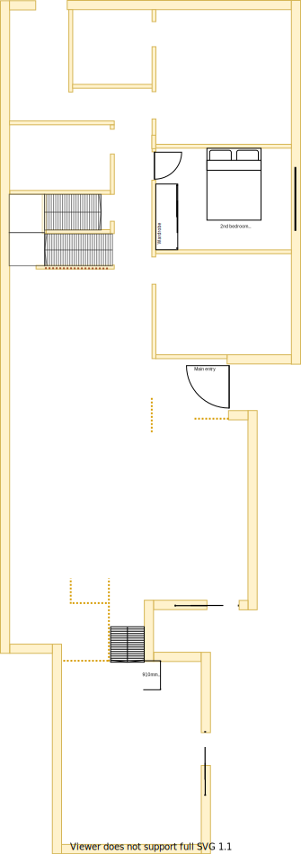

# Section E

## Context
Section E was a very large study in the lower level as per the original floor plan.

Figure LL2: TO-BE lower-level sections

There is/are:
* A sky-light installed outside the east wall
* Two downlights that were position for two side by side tables against the south wall  because it was a study
* A ducted heating vent beside the east window
* An external blind to the east of the window
* Sheer and bulky pinch pleated curtains with no thermo insulation lining

## Problem
1. This room can get very hot from the morning sun from the east 
2. There is no wardrobe 
3. There is no cooling system in this room
4. The current window frames are old, large and difficult to open behind the fly screen
5. All technology related wiring originated from here as it was the home office
6. Water has damaged some of the ceiling plaster board on the west side via the skylight
6. There are printer ink stains on the carpet
7. The curtains are broken and cumbersome to operate

## Solution
1. Renew the entire bedroom and make it identical to the corresponding Upper Level bedroom. Note, all non-master bedrooms should be identical

|As-is Section E model| To-be Section E model|
|---|---|
|||
Table LL-E1: AS-IS & TO-BE Section E model comparison

## Requirements
|ID|Description|Est. Cost|Additinal Preference Cost|
|---|---|---|--|
|LLE-REQ1|Replace carpet||
|LLE-REQ2|Install wardrobe||
|LLE-REQ3|Replace door handle||
|LLE-REQ4|Replace window & frame with double glazzed product||
|LLE-REQ5|Replace curtains with fitted night/day blinds||
|LLE-REQ6|Replace north facing powerpoints outlets with more sockets||
|LLE-REQ7|Replace plaster board where required||
|LLE-REQ8|Repaint||
|LLE-REQ9|Install ceiling fan||
|LLE-REQ10|Replace ducted heating vent||
|LLE-REQ11|Relocate NBN HFC/Coaxial wall port & NBN modem to [central storage on staircase platform](./section-DF-requirements.md)||
|LLE-REQ12|Remove cat5 port bracket and cables to [lounge room](./section-K-requirements.md)||
|LLE-REQ13|Remove UHF TV port bracket and splitter to port. Thus improving signal strength to other ports located in the house||
|LLE-REQ13|Remove external window blind||
|LLE-REQ14|Reposition downlights centrally||

## Known issues
|ID|Description|
|---|---|
|LLE-ISS-1|The large window frames openings will likely need to be filled with foamed clad and rendered to achieve a similar look & feel to the upper level. Seek Brett's advice on window transition plan|