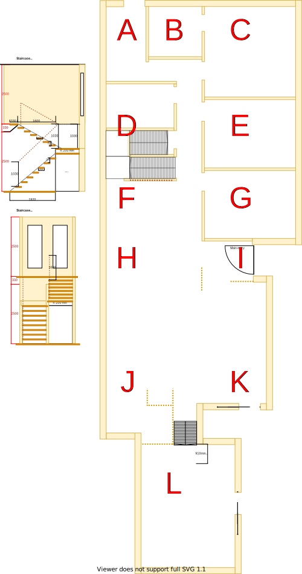

# Section E - 2nd Bedroom

## Context

Section E was originally a large study which was the same size as the 1st bedroom (Section G). It will now become the 2nd bedroom on the lower level.

Figure LL2: Expected layout

There is/are currently:
* A sky-light installed outside the east wall
* Two downlights were specifically positioned for the two side by side tables located against the south wall because it was a home office
* A ducted heating vent beside the east window
* An external window blind to the east of the window
* Sheer and freyed pinch pleated curtains with no thermo insulation lining

## Problem

1. This room can get very hot from the morning summer sun from the east 
2. There is no wardrobe 
3. There is no cooling system in this room
4. The current window frames are old, large and difficult to open behind the fly screen
5. All technology related wiring originated from here because it was a home office
6. Water has damaged some of the ceiling plaster board on the west side via the sky-light
6. There are printer ink stains on the carpet
7. The curtains are broken and cumbersome to operate

## Requirements

|ID|Description|Est. Cost|Alternative Solution Cost|
|:---|:---|:---|:---|
|LLE-REQ1|The bedroom shall have an efficient/effective wardrobe that maximises space|||
|LLE-REQ2|The bedroom shall have an appropriate number of LED downlights appropriately positioned|||
|LLE-REQ3|The bedroom shall be carpeted|||
|LLE-REQ4|The bedroom shall have an appropriately sized double glazed window|||
|LLE-REQ5**|The bedroom shall have a ducted heating vent. (already connected in section E, just replace vent)|||
|LLE-REQ6|The bedroom shall have a fitted night/day internal roller blind with sun/heat block|||
|LLE-REQ7**|The bedroom shall have a centrally installed ceiling fan|||
|LLE-REQ8|The bedroom shall have power outlets appropriately positioned near each corner|||
|LLE-REQ9|The same appliance/fixtures shall have been installed in the same positions as the other 1st & 2nd bedrooms for both levels|||
|LLE-REQ10|The room shall be refurbished to as new condition|||
|LLE-REQ11|The active NBN HFC/Coaxial wall port & NBN modem shall be relocated to [central storage on staircase platform](./section-D-requirements.md)|||
|LLE-REQ12|The cat5 port bracket and cables to [lounge room](./section-K-requirements.md) shall be removed|||
|LLE-REQ13|The UHF TV port bracket and splitter to port shall be removed. Thus improving signal strength to other ports located in the house|||
|LLE-REQ14|The room's external window blind shall be removed|||

** - Optional requirement which may prove unnecessary given the situation

## Solution

|Actual|Expected|
|:---:|:---:|
|||

Table LL-E1: Floor plan comparison

Note, although the bedroom will remain the same size, the furnishing sizes may vary and they need not remain the same (eg. window frame size & position of the downlights)

|Design principles|
|:---|
|Embrace value for money first, but select premium if just 20% more than standard pricing|
|No maintenance over low/some maintenance|
|Reduce overall transit as the basis of location|
|Rooms/resources that are used together should be adjacent to one another|
|Rooms/resources that are frequented in terms of time spent/people should attract more space/investment than others|

Table LL-E2: The design principles that should be influencing the solution's location/choices/decisions

### Steps

1. Repurpose as the 2nd bedroom and refurbish it in line with non-master bedrooms and the rest of the house

### Considerations

1. LLE-REQ5 & LLE-REQ7
    - Subject to the decision on centralised heating & cooling option selected

## Known issues

|ID|Description|
|:---|:---|
|LLE-ISS-1|Brett to advice how window/frame consistency can be achieved between levels|

## Photos

Photo: LSE-photo-1 - Full size window and external blind

## References

1. Ikea
    - https://www.ikea.com/au/en/p/elvarli-2-sections-white-s59302996/
    - https://www.ikea.com/au/en/p/elvarli-1-section-white-s19157901/
2. Carpet Tiles 1
    - https://www.carpettiles1.com.au/carpet-tiles/product-details/matin-dark-tan-brown--model:cpt-393