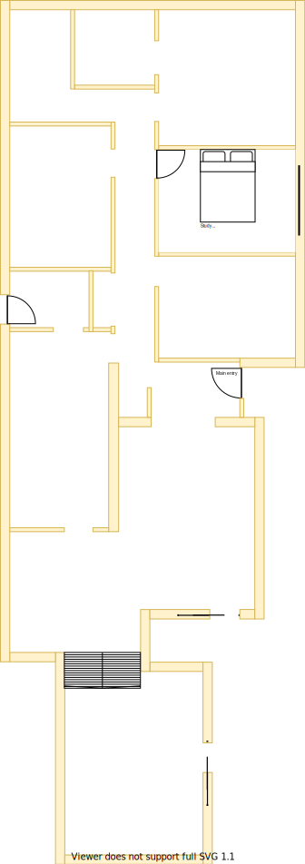

# Section E - 2nd Bedroom

## Context

Section E was originally a large study which was the same size as the 1st bedroom (Section G). It will now become the 2nd bedroom on the lower level.

Figure LL2: Expected layout

There is/are currently:
* A sky-light installed outside the east wall
* Two downlights were specifically positioned for the two side by side tables located against the south wall because it was a home office
* A ducted heating vent beside the east window
* An external window blind to the east of the window
* Sheer and freyed pinch pleated curtains with no thermo insulation lining

## Problem

1. This room can get very hot from the morning summer sun from the east 
2. There is no wardrobe 
3. There is no cooling system in this room
4. The current window frames are old, large and difficult to open behind the fly screen
5. All technology related wiring originated from here because it was a home office
6. Water has damaged some of the ceiling plaster board on the west side via the skylight
6. There are printer ink stains on the carpet
7. The curtains are broken and cumbersome to operate
8. Inequity will arise if there are differences in size, quality and positioning between upper and lower levels

## Solution

1. Repurpose as the 2nd bedroom in Section C because of the following principles:
    * Embrace value for money first, but select premium if just 20% more than standard pricing
        - Minimising structural changes will reduce costs
    * Symmetry with split occupancy
        - Equally equitable whether on the upper or lower levels
    * Reduce overall transit as the basis of location
        - Close proximity to all resources
    * Rooms/resources that are used together should be adjacent to one another
        - Close proximity to stairs, and bathroom
    * Rooms/resources that are frequented in terms of time spent/people should attract more space/investment than others
2. Choose appliances and fixtures that satisfy the following principles in order:
    1. Symmetry with split occupancy 
        - Same quality and fittings whether on upper or lower levels 
    2. Embrace value for money first, but select premium if just 20% more than standard pricing
    3. No maintenance over low/some maintenance

|Actual|Expected|
|:---:|:---:|
|||

Table LL-E1: Floor plan comparison

## Symmetric Requirements

|ID|Description|Est. Cost|Alternative Solution Cost|
|:---|:---|:---|:---|
|LLE-REQ1|The bedroom must have an efficient/effective wardrobe that maximises space|||
|LLE-REQ2|The bedroom must have an appropriate number of LED downlights|||
|LLE-REQ3|The bedroom must be carpeted|||
|LLE-REQ4|The bedroom must have an appropriately sized double glazzed window|||
|LLE-REQ5|The bedroom must have a ducted heating vent|||
|LLE-REQ6|The bedroom must have a fitted night/day internal roller blind with sun/heat block|||
|LLE-REQ7|The bedroom must have a centrally installed ceiling fan|||
|LLE-REQ8|The bedroom must have power outlets appropriately positioned near each corner|||
|LLE-REQ9|The same appliance/fixtures must have been installed in the same positions as the other 1st & 2nd bedrooms for both levels|||

## Refurbishing Requirements

|ID|Description|Est. Cost|Alternative Solution Cost|
|:---|:---|:---|:---|
|LLE-REQ10|Refurbish existing appliances/fixtures if equivalent & no loss in quality between upper and lower levels|||
|LLE-REQ11|Relocate the active NBN HFC/Coaxial wall port & NBN modem to [central storage on stair case platform](./section-DF-requirements.md)|||
|LLE-REQ12|Remove cat5 port bracket and cables to [lounge room](./section-K-requirements.md)|||
|LLE-REQ13|Remove UHF TV port bracket and splitter to port. Thus improving signal strength to other ports located in the house|||
|LLE-REQ14|Remove external window blind|||

## Known issues

|ID|Description|
|:---|:---|
|LLE-ISS-1|Brett to advice how window/frame consistency can be achieved between levels|
