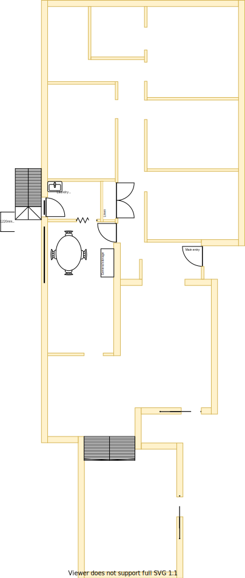
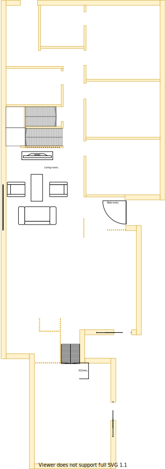

# Section F - Lounge room

## Context

Section F was originally the laundry & meals area on the lower level. The laundry has now been moved to the north west most corner into the original [bathroom in section A](./section-A-requirements.md) and the meals area has becomed the dining room & kitchen island bench.

Figure LL2: Expected layout

There is/are currently:
* A single globe light (ie. non-downlight) inside for the laundry
* A single globe light (ie. non-downlight) outside the laundry for the backyard staircase
* Two downlights installed in the meals area
* The linen cupboard is built into the wall on the east of the laundry
* A laundry staircase to the backyard is 1.2m above ground level 
* A man hole accessible on the west side ceiling in the laundry
* A lot of large windows that absorb the summer sun
* A ducted heating vent on the west side of meals area 

## Problem

1. In summer this whole western section is almost unbearable. It's the hottest area in the house even with the external kitchen window blind down and all the night/day blockout blinds closed
2. The laundry is too small despite having the dryer installed above the top loader washing machine
3. There is an unusually loud hammering with respect to plumbing in the house. This is typically observable when toilets are flushed, showers turned on/off, washing machine operates
4. The large window built into the laundry door lets a lot of sun/heat in
5. The wooden 1.2m high staircase outside the laundry is very weathered from climate and is becoming dangerous to use, thus the laundry is hung on the clothes line outside via the main front door entrance. Therefore, the laundry is better placed near ground level in the north most [section](./section-A-requirements.md)
6. The external meals area window frames are weathered from the climate and barely holding together

## Requirements

|ID|Description|Est. Cost|Alternative Solution Cost|
|:---|:---|:---|:---|
|LLF-REQ1|The lounge room shall have an appropriate number of power outlets installed and UHF TV connection and a cat5 connection to the staircase storage|||
|LLF-REQ2|The lounge room shall have an appropriate number of LED downlights|||
|LLF-REQ3|The lounge room shall be carpeted|||
|LLF-REQ4**|The lounge room shall be connected to the ducted heating|||
|LLF-REQ5|The lounge room shall have an appropriately sized double glazed windows|||
|LLF-REQ6|The lounge room windows shall be able to be opened for ventilation|||
|LLF-REQ7|The lounge room windows shall have a fly screen to keep the insects out|||
|LLF-REQ8|The lounge room shall have a fitted night/day internal roller blinds with sun/heat block|||
|LLF-REQ9**|The lounge room shall have a centrally installed ceiling fan|||
|LLF-REQ11|The same appliance/fixtures shall have been installed as with the other lounge room|||
|LLF-REQ12|The external light shall be replaced with a with directed downlight|||
|LLF-REQ13|The external door, security door and staircase shall be removed and replaced with a appropriate weather proof and insulated coverings|||

## Solution

|Actual|Expected|
|:---:|:---:|
|||

Table LL-F1: Floor plan comparison

|Design principles|
|:---|
|Embrace value for money first, but select premium if just 20% more than standard pricing|
|Embrace natural lighting and reduce demand on heating/cooling systems|
|Rooms/resources that are used together should be adjacent to one another|
|Rooms/resources that are frequented in terms of time spent/people should attract more space/investment than others|

Table LL-F2: The design principles that should be influencing the solution's location/choices/decisions

### Steps
1. Move the laundry and plumbing fixtures to the north side of the house where its almost ground level and beside the clothes line
2. Create a more open space by removing walls and cabinets that occupy **central** areas
3. Remove the outdoor staircase, back door & security door and replace the gap with well insulated filler
4. Replace full length larger windows with a more appropriate temperature managed window solution to manage the impact of the western sun/heat

### Considerations

1. LLF-REQ1
    - Subject to the decision on centralised heating & cooling option selected

## Known issues

|ID|Description|
|:---|:---|
|LLF-ISS-1|Brett to advice how window/frame consistency can be achieved between levels|
|LLF-ISS-2|Need to investigate whether we dedicate one TV aerial per level as there is no signal repeaters installed and splitting reduces the signal strength. Note, there are currently four splitting points already installed throughout the house|

## Photos

Photo: LSF-photo-1 - Back door & staircase to be removed

Photo: LSF-photo-2 - Meals area window with no external blind but with night/day internal blind

## References
1. Bunnings
    - https://www.bunnings.com.au/johnson-tiles-500-x-500mm-white-jura-stone-gloss-ceramic-floor-tile-4-pack_p6661693
2. Kaboodle kitchen fixtures and furnishings have not been researched yet!
3. Carpet Tiles 1
    - https://www.carpettiles1.com.au/carpet-tiles/product-details/matin-dark-tan-brown--model:cpt-393