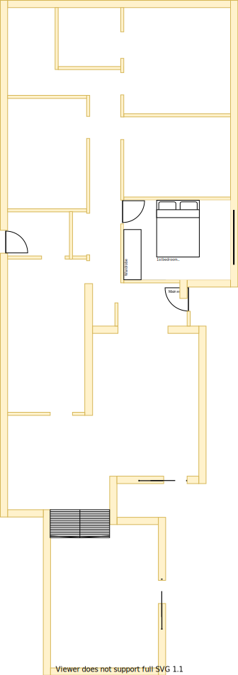
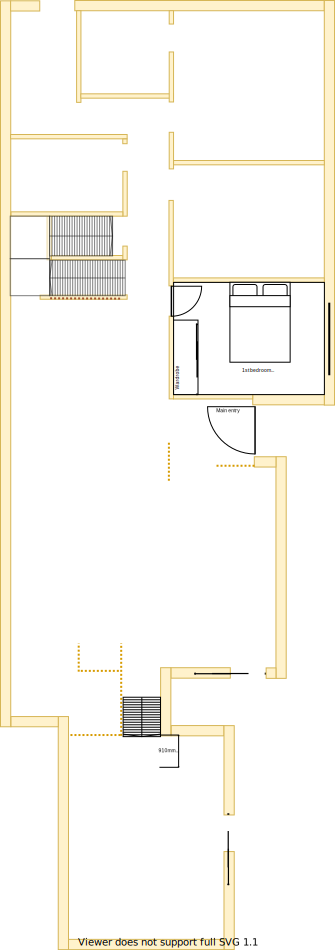

# Section G - 1st Bedroom

## Context

Section G remains as the 1st bedroom encounted upon entry from the front door on the lower level.

Figure LL2: Expected layout

There is/are currently:
* Two downlights and a bedside wall attached reading light in the south east wall of the room
* A ducted heating vent beside the east window
* An external window blind to the east of the window
* Bulky pinch pleated curtains with thermo insulation lining

## Problem

1. The wardrobe is built into the wall and it is bulky
2. There is no cooling system in this room
3. The current window frames are old, large and difficult to open behind the fly screen
4. There is a halogen downlight dimmer transformer installed
5. The curtains are heavy and cumbersome to operate
6. Longevity and resale value will be impacted if there are less than three rooms

## Symmetric Requirements

|ID|Description|Est. Cost|Alternative Solution Cost|
|:---|:---|:---|:---|
|LLG-REQ1|The bedroom shall have an efficient/effective wardrobe that maximises space|||
|LLG-REQ2|The bedroom shall have an appropriate number of LED downlights appropriately positioned|||
|LLG-REQ3|The bedroom shall be carpeted|||
|LLG-REQ4|The bedroom shall have an appropriately sized double glazed window|||
|LLG-REQ5**|The bedroom shall have a ducted heating vent|||
|LLG-REQ6|The bedroom shall have a fitted night/day internal roller blind with sun/heat block|||
|LLG-REQ7**|The bedroom shall have a centrally installed ceiling fan|||
|LLG-REQ8|The bedroom shall have power outlets appropriately positioned near each corner|||
|LLG-REQ9|The same appliance/fixtures shall have been installed in the same positions as the other 1st & 2nd bedrooms for both levels|||

## Refurbishing Requirements

|ID|Description|Est. Cost|Alternative Solution Cost|
|:---|:---|:---|:---|
|LLG-REQ10|The room shall be refurbished to as new condition|||
|LLG-REQ11|The rooms external window blind shall be removed||
|LLG-REQ12|The downlight dimmer transformer shall be replaced with a standard transformer|||

** - Optional requirement which may prove unnecessary given the situation

## Solution

|Actual|Expected|
|:---:|:---:|
|||

Table LL-G1: Floor plan comparison

Note, although the bedroom will remain the same size, the furnishing sizes may vary and they need not remain the same (eg. window frame size, wardrobe & position of the downlights)

|Design principles|
|:---|
|Embrace value for money first, but select premium if just 20% more than standard pricing|
|No maintenance over low/some maintenance|
|Reduce overall transit as the basis of location|
|Rooms/resources that are used together should be adjacent to one another|
|Rooms/resources that are frequented in terms of time spent/people should attract more space/investment than others|

Table LL-G2: The design principles that should be influencing the solution's location/choices/decisions

### Steps

1. Keep the 1st bedroom in the same location and refurbish it in line with non-master bedrooms in the rest of the house  

### Considerations

1. LLG-REQ5 & LLG-REQ7
    - Subject to the decision on centralised heating & cooling option selected

## Known issues

|ID|Description|
|:---|:---|
|LLG-ISS-1|Brett to advice how window/frame consistency can be achieved between levels|
|LLG-ISS-2|The south most facing downlight experiences routine faults or flickering. I suspect that there is a fault in the wiring or in the downlight housing|

## Photos

Photo: LSE-photo-1 - Full size window and external blind

## References

1. Ikea
    - https://www.ikea.com/au/en/p/elvarli-2-sections-white-s59302996/
    - https://www.ikea.com/au/en/p/elvarli-1-section-white-s19157901/
2. Carpet Tiles 1
    - https://www.carpettiles1.com.au/carpet-tiles/product-details/matin-dark-tan-brown--model:cpt-393