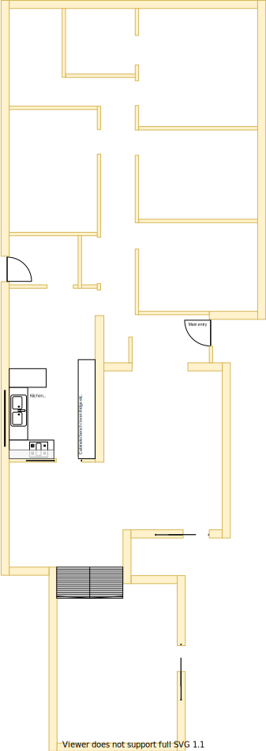
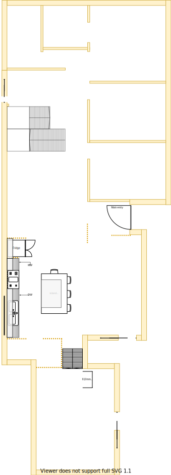

# Section H

## Context
Section H was the original laundry, meals area and kitchen in the lower level as per the original floor plan.

Figure LL2: TO-BE lower-level sections

There is/are:
* A single globe light (ie. non-downlight) inside for the laundry
* A single globe light (ie. non-downlight) outside the laundry for the backyard staircase
* A Bosch instant hot water system installed outside on the west side. The system is about 15yo 
* A Braemar heeting system installed outside on the west side. This system is about 5+yo 
* Two downlights installed in the meals
* Three downlights installed in the kitchen
* The linen cupboard in on the east of the laundry
* A laundry staircase to the backyard is 1.2m above ground level 
* A man hole accessible on the west side ceiling in the laundry
* A lot of large windows that take in the afternoon western sun
* A ducted heating vent on the west side of meals area 
* An external blind to the west of the kitchen
* A fridge with water and ice dispenser that is connected to plumbing on the east side installed in the allocated cavity in the cabinet
* A pantry from ceiling to floor in the south east section of the cabinet
* Many cabinets as part of the kitchen under benches, over/under stove etc

## Problem
1. In summer this whole western section is almost unbearable. It's the hostest area in the house even with the external kitchen blind down and all the night/day blockout blinds installed
2. The external window frames are weathered from the climate and barely holding together
3. Although the kitchen has a more modern (24 years ago) design its south west cooking & preperation area is too cramped for even a single cook
4. The large fridge sticks out by approx 10+cm 
5. The meals area table and the dining room table are frequently used as additional workspace and preperation area
6. The laundry is too small despite having the dryer installed above the top loader washing machine
7. There is an unusually loud hammering with respect to plumbing in the house. This is typically observable when toilets are flushed, showers turned on/off, washing machine operates
8. The large window built into the door lets a large amount of sun/heat in
9. The wooden 1.2m high stairs outside the laundary is very weathered from climate and is becoming dangerous to use, thus the laundry is hung on the clothes line outside via the main front door entrance. Thus the [laundry is better placed near ground level](./section-A-requirements.md)
10. [Electrical surges are encountered](./section-I-requirements.md) and the breaker trips when using a certain combination of appliances in the kitchen/lounge/dining room

## Solution
1. Move the laundry to the north side of the house where its almost ground level and beside the clothes line
2. Create a more open space by removing walls and cabinets that occupy central areas
3. Replace full length larger windows with shorter ones to reduce the impact of the western sun/heat
4. Create more spacing between stove and sink

|As-is Section H model| To-be Section H model|
|---|---|
|||

Table LL-H1: AS-IS & TO-BE Section H model comparison

## Requirements
|ID|Description|Est. Cost|Additinal Preference Cost|
|---|---|---|---|
|LLH-REQ1|Remove all laundry & linen cupboard walls and doors||
|LLH-REQ2|Remove laundry plumbing fixtures||
|LLH-REQ3|Remove back door and back security door||
|LLH-REQ3|Replace door with well insulated rendered cladded foam||
|LLH-REQ4|Remove, replace & install new stove, oven, rangehood & sink||
|LLH-REQ5|Cut out cavity behind fridge so that it can be setback further into wall ([refer question 1 below](#Questions))||
|LLH-REQ6|Replace all broken cabinet doors/hinges||
|LLH-REQ7|Extend existing bench along western wall||
|LLH-REQ8|Replace full-length window frames with short and long double glazzed windows||
|LLH-REQ9|Replace or enhance existing night/day blinds for new window configuration||
|LLH-REQ10|Install overhanging cabinets above shortened windows along western wall||
|LLH-REQ11|Install large workspace island bench with poweroutlets available on side||
|LLH-REQ12|Repaint||
|LLH-REQ13|Replace plaster board where required||

## Known issues
|ID|Description|
|---|---|
|LLH-ISS-1|There is a known defect with this model of the Bosch instant hot water system that occurs only under very cold conditions. Under very cold weather conditions the gas inlet somehow gets blocked. This starves the system of fuel and cuts all hot water flow to the house (ie. no water comes out of the dedicated hot water taps). The solution is to reboot the system by turning openning and closing the gas inlet valve and turning off the power. Because, we know the workaround it is not necessary to replace it yet

## Questions
1. Is cutting out a setback for the fridge a bad idea given that it assumes that the next fridge installed in this spot is the same dimensions?
2. Where will the man hole be installed on the upper level?
3. How do repairers maintain fixtures in/above ceiling within 40cm of space?