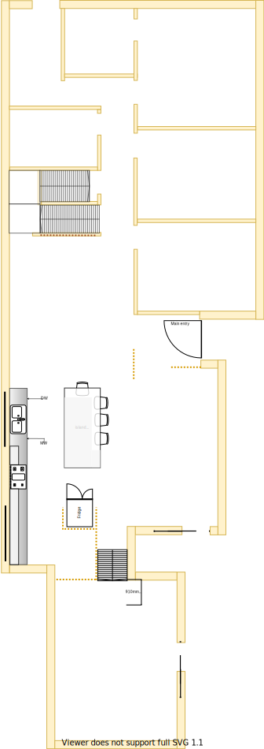
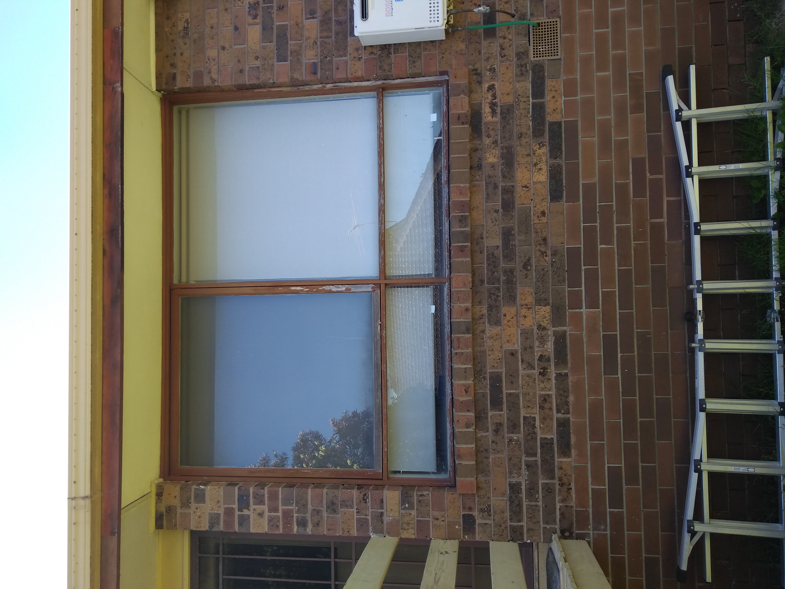

# Section H - Kitchen [Shared Resource]

## Context

Section H was originally the combined laundry, meals area and kitchen on the lower level. The kitchen has now been extended to occupy both the meals and the laundry areas.

Figure LL2: Expected layout

There is/are currently:
* A single globe light (ie. non-downlight) inside for the laundry
* A single globe light (ie. non-downlight) outside the laundry for the backyard stair case
* A Bosch instant hot water system installed outside on the west side. The system is about 15yo 
* A Braemar heating system installed outside on the west side. This system is about 5+yo 
* Two downlights installed in the meals area
* Three downlights installed in the kitchen
* The linen cupboard is built into the wall on the east of the laundry
* A laundry stair case to the backyard is 1.2m above ground level 
* A man hole accessible on the west side ceiling in the laundry
* A lot of large windows that absorb the summer sun
* A ducted heating vent on the west side of meals area 
* An external window blind to the west of the kitchen
* A fridge with water and ice dispenser that is connected to plumbing on the east side installed in the allocated cavity in the cabinet
* A ceiling to floor pantry in the south east section of the cabinet
* Many cabinets as part of the kitchen under benches, over/under stove etc

## Problem

1. In summer this whole western section is almost unbearable. It's the hostest area in the house even with the external kitchen window blind down and all the night/day blockout blinds closed
2. The external window frames are weathered from the climate and barely holding together
3. Although the kitchen has a more modern (24 years ago) design, its south west cooking & preperation area is too cramped for even a single cook
4. The large fridge sticks out by approx 10+cm 
5. The meals area table and the dining room table are frequently used as additional workspace and preperation area
6. The laundry is too small despite having the dryer installed above the top loader washing machine
7. There is an unusually loud hammering with respect to plumbing in the house. This is typically observable when toilets are flushed, showers turned on/off, washing machine operates
8. The large window built into the laundry door lets a lot of sun/heat in
9. The wooden 1.2m high stair case outside the laundry is very weathered from climate and is becoming dangerous to use, thus the laundry is hung on the clothes line outside via the main front door entrance. Therefore, the [laundry is better placed near ground level](./section-A-requirements.md)
10. [Electrical surges are encountered](./section-I-requirements.md) and the breaker trips when using a certain combination of appliances in the kitchen/lounge/dining room

## Requirements

|ID|Description|Est. Cost|Alternative Solution Cost|
|:---|:---|:---|:---|
|LLH-REQ1**|The kitchen shall be made larger to accomodate more cooks working in collaboration. The meals area's ducted heating vent will need to be removed|||
|LLH-REQ2|The kitchen windows shall be double glazzed and appropriately sized for optimal light and temperature control|||
|LLH-REQ3|The kitchen windows shall have night/day blinds for improved temperature control and privacy|||
|LLH-REQ4|The kitchen shall have a long work bench with distributed space to avoid people getting in each anothers way|||
|LLH-REQ5|The kitchen shall have a large island workstation|||
|LLH-REQ6|The kitchen shall have new stove & oven appliances|||
|LLH-REQ7|The kitchen shall be refurbished to as new condition|||
|LLH-REQ8|The kitchen and general plumbing should not cause loud hammering sounds across all plumbing appliances and their inlets|||

## Solution

|Actual|Expected|
|:---:|:---:|
|||

Table LL-H1: Floor plan comparison

|Design principles|
|:---|
|Embrace value for money first, but select premium if just 20% more than standard pricing|
|Embrace natural lighting and reduce demand on heating/cooling systems|
|Rooms/resources that are used together should be adjacent to one another|
|Rooms/resources that are frequented in terms of time spent/people should attract more space/investment than others|

Table LL-H2: The design principles that should be influencing the solution's location/choices/decisions

### Steps
1. Move the laundry and plumbing fixtures to the north side of the house where its almost ground level and beside the clothes line
2. Create a more open space by removing walls and cabinets that occupy **central** areas
3. Remove the stair case, back door & security door and replace the gap with well insulated filler
4. Replace full length larger windows with a more appropriate temperature managed window solution to manage the impact of the western sun/heat
5. Create more spacing between stove and sink
6. Replace and install new stove and oven 

### Considerations

1. LLH-REQ1
    - Subject to the decision on centralised heating & cooling option selected

## Known issues

|ID|Description|
|:---|:---|
|LLH-ISS-1|There is a known defect with the Bosch instant hot water system that occurs only under very cold conditions. Under such conditions the gas inlet somehow gets blocked. This starves the system of fuel and cuts all hot water flow to the house (ie. no water comes out of the hot water taps). The solution is to reboot the system by opening and closing the gas inlet valve and reseting the power. Because, we know the workaround it is not necessary to replace it yet|

## Photos

Photo: LSH-photo-1 - Back door & stair case to be removed

Photo: LSH-photo-2 - Meals area window with no external blind but with night/day internal blind

Photo: LSH-photo-3 - Kitchen window with external window blind beside instant hot water unit & ducted heating system

## References
1. Bunnings
    - https://www.bunnings.com.au/johnson-tiles-500-x-500mm-white-jura-stone-gloss-ceramic-floor-tile-4-pack_p6661693
2. Kaboodle kitchen fixtures and furnishings have not been researched yet!