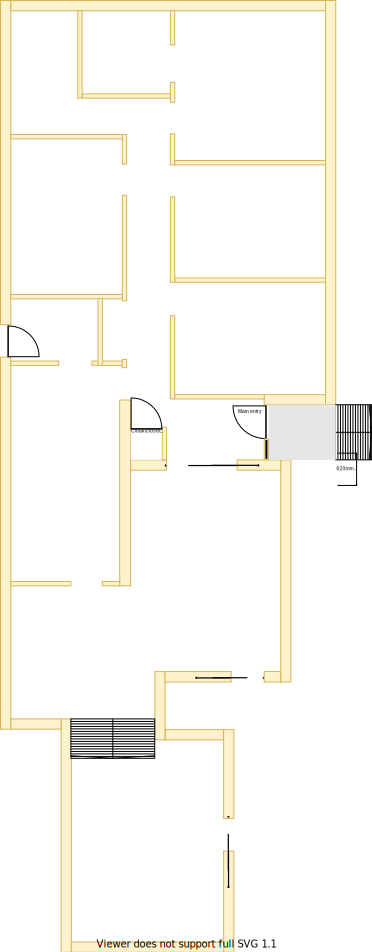
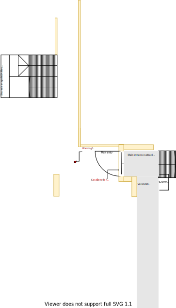
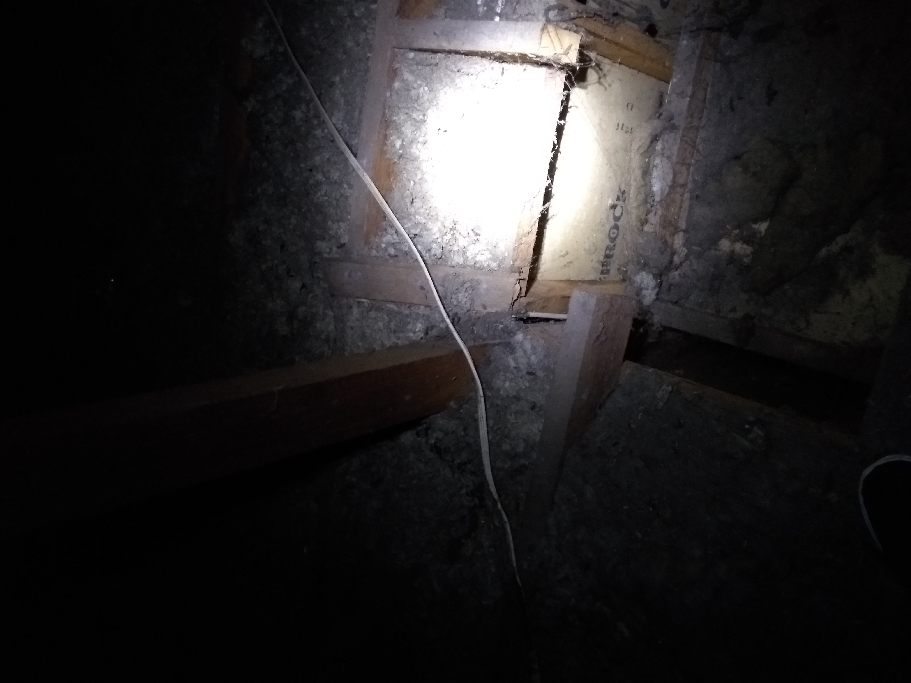
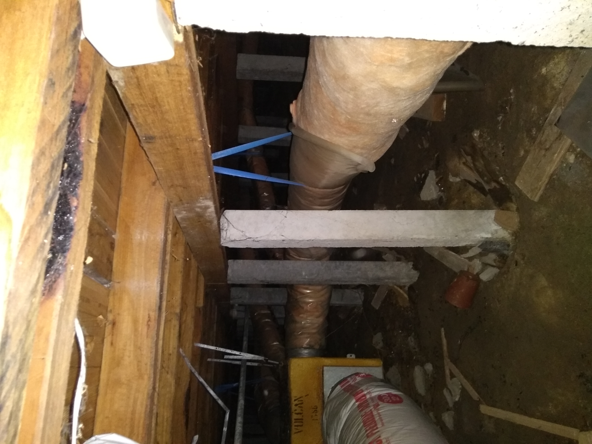

# Section I

## Context

Section I still is the main entrance and hallway passage access in the lower level as per the original floor plan.

Figure LL2: TO-BE lower-level sections

There is/are:
* A single downlight inside
* Three downlights installed outside which light up the verandah
* Steps leading up to the door
* The electricity box (with smart meter) is outside the front door
* A sklight and an old flurecent cicular tube light installed in the north part of the hallway
* A ducted heating INLET

## Problem

1. The original design of the house is closed plan with walls and doors everywhere
2. The front door has poor sealing and both cold and hot enter. All doors through to kitcken needed to be temporarily removed to get fridge into the kitchen
3. The long window beside the front door lets in a lot of heat during the summar 
4. The security door gets jammed against the concrete in winter and often cannot be locked properly
5. There are large dark grey stains that cannot be removed on the carpet by the entrance
6. The cloak closet is bulkly and primarily serves as the internal air inlet for central heating
7. The electricity box has a lot of old surge protectors and switches installed and we frequently encounter trips when there is too much load caused by a combination of devices (eg. kettle, microwave, TV)
8. The skylight has previously had water leaks in heavy rain
9. There is a leak in the roof that has caused the ceiling plaster board near the cloak closet to become damp with a small hole to the roof

## Solution

1. Replace the security door and the door with a larger front door that is well sealed
2. Remove all unneccessary doors, walls and closed spaces to create an open floor plan
3. Consolidate the electricity system

|As-is Section I model| To-be Section I model|
|:---:|:---:|
|||

Table LL-I1: AS-IS & TO-BE Section I model comparison

## Requirements

|ID|Description|Est. Cost|Alternative Solution Cost|
|:---|:---|:---|:---|
|LLI-REQ1|Replace carpet at entrance and hallway with anything cheap and durable|||
|LLI-REQ2|Replace main door with larger main entry door|||
|LLI-REQ3|Remove cloak closet (refer to [issue LLI-ISS-1](#Known-Issues))|||
|LLI-REQ4|Remove sliding door and overhead to lounge room|||
|LLI-REQ5|Remove wall between entrance and lounge room to the south|||
|LLI-REQ6|Remove door between hall and kitchen to the west|||
|LLI-REQ7|Remove wall between hall and kitchen to the west|||
|LLI-REQ8|Repaint|||
|LLI-REQ8|Re-locate Breamar controller that is currently installed on wall of cloak closet|||
|LLI-REQ9|Renew electricity box with improved load management switches|||
|LLI-REQ10|Remove skylight|||
|LLI-REQ11|Replace old flurecent light with standard downlight|||
|LLI-REQ12|Replace plaster board where required|||

## Known issues

|ID|Description|
|:---|:---|
|LLI-ISS-1|When inspecting the roof above the closet there is a vertical beam that connects to the ridge where the rafters also connect. This beam appears to run down along the north east corner of the cloak closet (refer photo LLI-photo-1). However, it seems to stop at the floor and is not found underneath the house at that same spot (refer photo LLI-photo-2). Therefore, I'm unsure if this critical load bearing point or not!|

## Photos

Photo: LLI-photo-1

Photo: LLI-photo-2

## Questions

1. Is there any benefit setting the front door back 68cm given that the front door will be entirely replaced?
2. If it is determined that the beam by the cloak closet is load bearing please advise on the cost/benefits ot its removal?