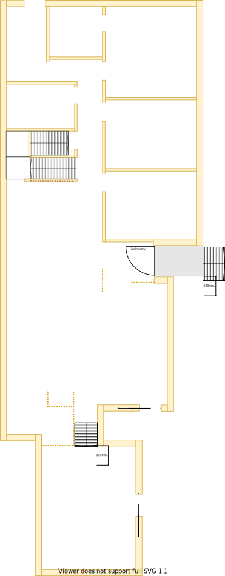

# Section G

## Context
Section I represents the main entrance and hallway passage access in the lower level as per the original floor plan.

## Problem
1. The original design of the house is closed plan with walls and doors everywhere
2. The front door has poor sealing and cold and hot enter. All doors through to kitcken needed to be temporarily removed to get fridge into the kitchen
3. The long window beside the front door lets in a lot of heat during the summar 
4. The security door gets jammed against the concrete in winter and often cannot be locked properly
5. There are large dark grey stains that cannot be removed
6. The cloak closet does not really serve any purpose other than providing for the internal air inlet for central heating

## Solution
1. Replace the security door and the door with a larger front door that is well sealed
2. Remove all unneccessary doors, walls and closed spaces to create an open floor plan

Renew the entire bedroom and make it identical to the corresponding Upper Level bedroom

|As-is Section G model| To-be Section G model|
|---|---|
|||
Table LL-G1: AS-IS & TO-BE Section G model comparison

## Requirements
|ID|Description|Est. Cost|Additinal Preference Cost|
|---|---|---|--|
|LLI-REQ1|Replace carpet at entrance and hallway with anything cheap and durable||
|LLI-REQ2|Replace main door with larger main entry door||
|LLI-REQ3|Remove cloak closet||
|LLI-REQ4|Remove sliding door to lounge room||
|LLI-REQ5|Remove wall between entrance and lounge room||
|LLI-REQ6|Remove door between hall and kitchen||
|LLI-REQ6|Remove wall between hall and kitchen||
|LLI-REQ7|Repaint||
|LLI-REQ8|Re-locate Breamar controller that currently installed on wall of cloak closet||

## Known issues
|ID|Description|
|---|---|
|LLI-ISS-1|When inspecting the roof above the closet there is a vertical beam that connects to the ridge where the rafters also connect. This beam appears to run down along the north east corner of the cloak closet (refer photo LLI-photo-1). However, it seems to stop at the floor and is not found underneath the house at that same spot (refer photo LLI-photo-2). Therefore, I'm unsure if this critical load bearing point or not!|

## Photos

Photo: LLI-photo-1

Photo: LLI-photo-2

## Questions
1. Is there any benefit setting the front door back 68cm given that the front door will be entirely replaced?