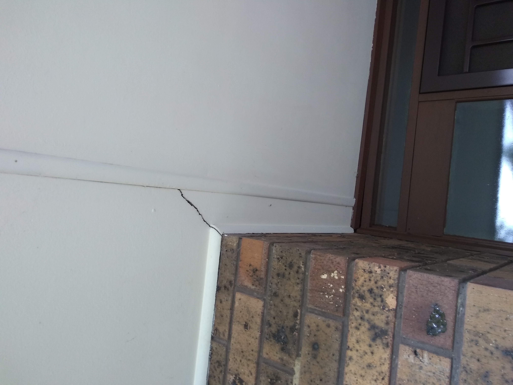

# Section I - Entry [Shared Resource]

## Context

Section I remains as the main entrance and hallway passage access in the lower level.

Figure LL2: Expected layout

There is/are currently:
* A single downlight inside
* Three downlights installed outside which light up the verandah
* Steps leading up to the door
* The electricity box (with smart meter) is outside the front door
* A sky-light and an old flurecent cicular tube light installed in the north part of the hallway
* A ducted heating **INLET**
* Carpeting across all hall ways

## Problem

1. The original design of the house is a closed plan with walls and doors everywhere
2. The front door has poor sealing and both cold and hot enter
3. The long window beside the front door lets in a lot of heat in during the summer 
4. The security door gets jammed against the concrete in winter and often cannot be locked
5. There are large dark grey stains that cannot be removed on the carpet by the entrance
6. The cloak closet is bulkly and primarily serves as the internal air inlet for central heating
7. The electricity box has a lot of old surge protectors and switches installed and we frequently encounter trips when there is too much load caused by a combination of devices (eg. kettle, microwave, TV)
8. The sky-light has previously had water leaks in heavy rain
9. There is a leak in the roof that has caused the ceiling plaster board near the cloak closet to become damp with a small hole to the roof

## Requirements

|ID|Description|Est. Cost|Alternative Solution Cost|
|:---|:---|:---|:---|
|LLI-REQ1|All hallways shall use a durable tile based flooring|||
|LLI-REQ2|The entrance shall have a larger front door to handle better removal of larger items (eg. large fridge)|||
|LLI-REQ3|The entrance shall have an open plan design (refer to [issue LLI-ISS-1](#Known-Issues))|||
|LLI-REQ4**|There shall be a central location to re-locate the Breamar controller that is currently installed on the wall of cloak closet [perhaps on the platform on the central multi-level stair case]|||
|LLI-REQ5|The electricity box shall be improved with better load management switches|||
|LLI-REQ6|The hallway sky-light and the fluorescent light shall be replaced with appropriately positioned downlights|||
|LLI-REQ7|The entrance and hallways shall be refurbished to as new condition|||

** - Optional requirement which may prove unnecessary given the situation

## Solution

|Actual|Expected|
|:---:|:---:|
|||

Table LL-I1: Floor plan comparison

|Design principles|
|:---|
|Embrace value for money first, but select premium if just 20% more than standard pricing|
|Reduce overall transit as the basis of location|
|Rooms/resources that are used together should be adjacent to one another|
|Rooms/resources that are frequented in terms of time spent/people should attract more space/investment than others|

Table LL-I2: The design principles that should be influencing the solution's location/choices/decisions

### Steps

1. Replace the security door and the door with a single larger front door that is well sealed
2. Remove all unneccessary doors, walls and closed spaces (including cloak closet) to create an open floor plan
3. Consolidate the electricity system

### Considerations

1. LLI-REQ4
    - Subject to the decision on centralised heating & cooling option selected
    - Some central heating/cooling controller will need to be appropriately located

## Known issues

|ID|Description|
|:---|:---|
|LLI-ISS-1|When inspecting the roof above the closet there is a vertical beam that connects to the ridge where the rafters also connect. This beam appears to run down along the north east corner of the cloak closet (refer photo LLI-photo-1). However, it seems to stop at the floor and is not found underneath the house at that same spot (refer photo LLI-photo-2). Therefore, I'm unsure if this critical load bearing point or not!|

## Photos

Photo: LLI-photo-1 - Vertical beam connecting to the ridge beam 

Photo: LLI-photo-2 - Vertical bean stops at floor board

Photo: LLI-photo-3 - Hallway with sky-light

Photo: LLI-photo-4 - External main entrance overhead crack

## Questions

1. If it is determined that the beam by the cloak closet is load bearing please advise on the cost/benefits ot its removal? If prohibitive, then decorate it as feature

## References
1. Bunnings
    - https://www.bunnings.com.au/senso-urban-914-x-152-x-2mm-2-20m-whitetech-self-adhesive-vinyl-planks-16-pack_p6600075 