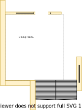
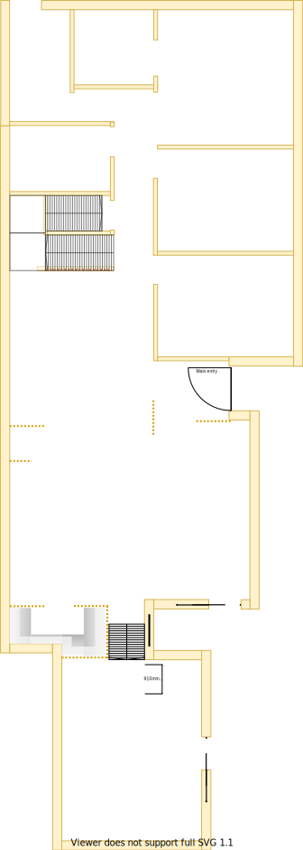
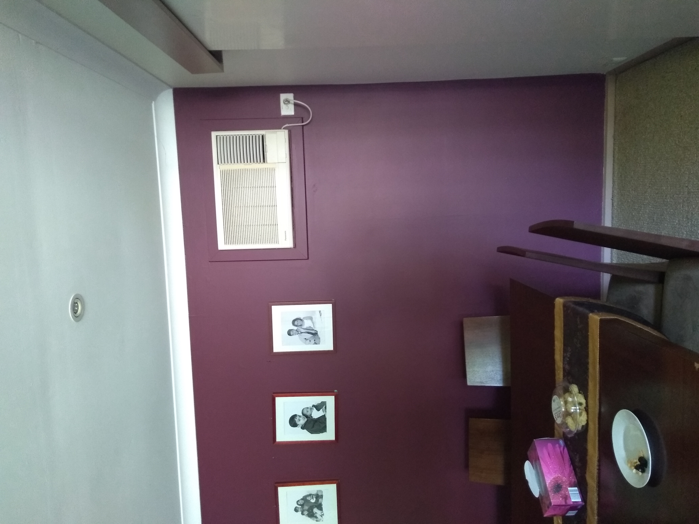
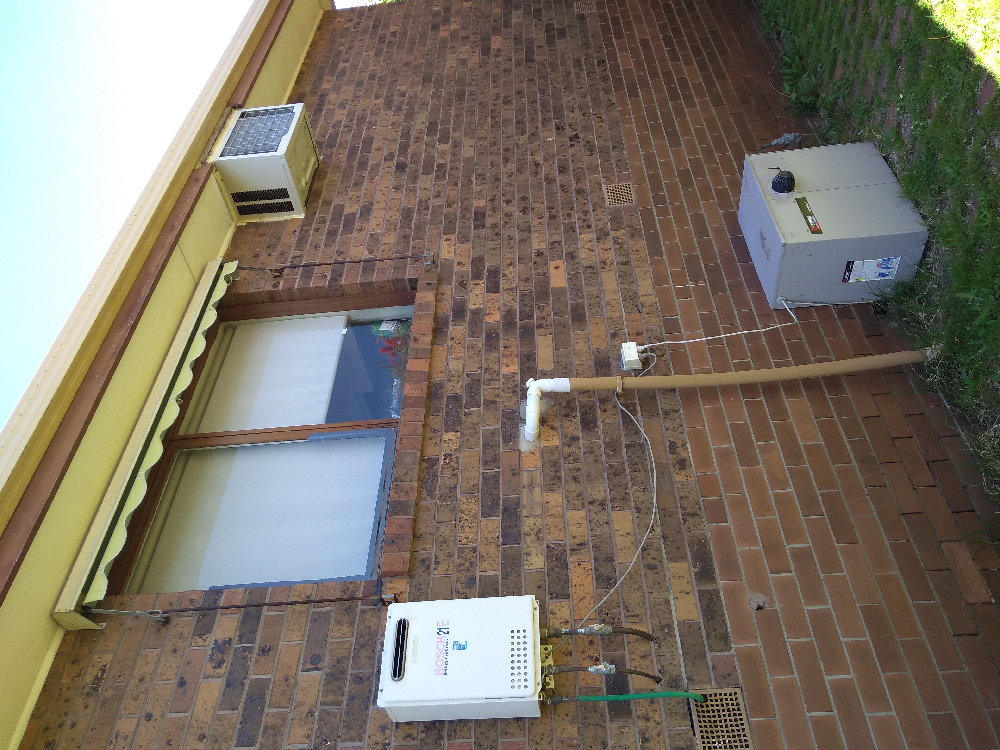
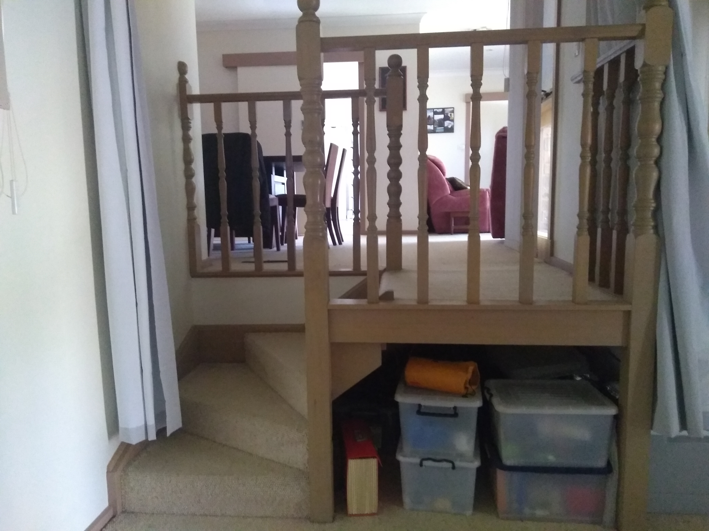
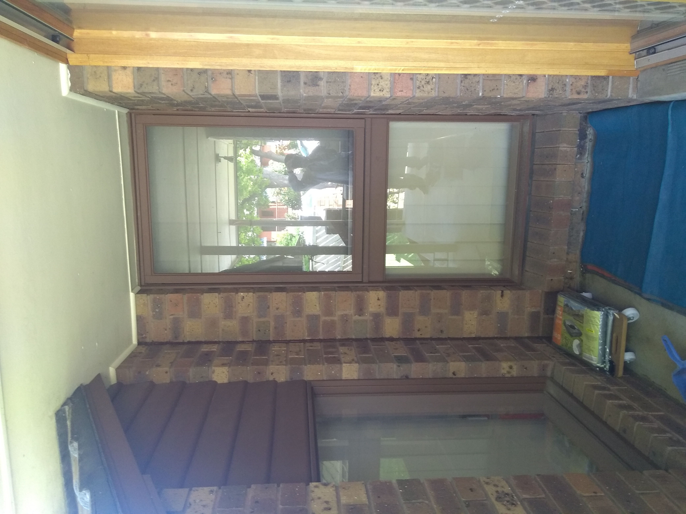

# Section J - Butler's pantry

## Context

The southern most region of Section J is now a walk in pantry. Note, the [dining room](./section-K-requirements.md) has been moved section K.

Figure LL2: Expected layout

There is/are currently:
* Two LED downlights installed operating from a dimmer transformer
* Small wall air-conditioner installed on the upper right corner of the west wall
* A sliding door to the kitchen 
* A stair case down to the rumpus room
* An outside hatch door for under house access on the south-west corner
* A ducted heating vent near the south wall beside the stair case to the rumpus room
* The potential to place a window on the west facing wall to invite a lot more heat & light

## Problem

1. The wall air-conditioner is old, highly inefficient and only capable of cooling a small area. When turned on the generated cool air moves its way down to the rumpus room 
2. There is a 2x2m water stain on the carpet near the north sliding door entrance to the kitchen
3. The ceiling plaster board is damaged by the leaky roof fascia board/gable end vent directly above the room
4. There is no natural lighting and the downlights shall be turned on even in daylight
5. The south east window onlooking the verandah extension cavity is pointless
6. The north most facing downlight frequently experiences flicker despite having change the globe

## Requirements

|ID|Description|Est. Cost|Alternative Solution Cost|
|:---|:---|:---|:---|
|LLJ-REQ1|The pantry shall be tiled|||
|LLJ-REQ2|The pantry shall have power outlets appropriately positioned near each corner|||
|LLJ-REQ3|The pantry shall have multi-level open shelves only (ie. no cabinets)|||
|LLJ-REQ4|The pantry shall have timber batton screening concealing its open shelves|||
|LLJ-REQ5|The leaky roof fascia board/gable end vent above rumpus room stair case shall be repaired|||
|LLJ-REQ6|The kitchen shall replace the wall air conditioner unit with a window|||

## Solution

|Actual|Expected|
|:---:|:---:|
|||

Table LL-J1: Floor plan comparison

|Design principles|
|:---|
|Embrace value for money first, but select premium if just 20% more than standard pricing|
|Embrace natural lighting and reduce demand on heating/cooling systems|
|Reduce overall transit as the basis of location|
|Rooms/resources that are used together should be adjacent to one another|
|Rooms/resources that are frequented in terms of time spent/people should attract more space/investment than others|

Table LL-J2: The design principles that should be influencing the solution's location/choices/decisions

### Steps

1. Remove ducted heating vent
2. Extended floor for pantry by reducing [staircase to rumpus room](./section-L-requirements.md)
3. Remove staircase banister
4. Mount shelved to batton timber screen 
5. Remove air conditioner

## Known issues

|ID|Description|
|:---|:---|
|LLJ-ISS-1|When inspecting the roof above the dining room it is clear that the fascia/gable end vent is barely holding together. Unlike the north facing roof fascia/gable end vent, I'm unsure whether this one would have been addressed as part of the upper level build?|
|LLJ-ISS-2|I contacted Coldflow who told me that an add on cooling system to the existing ducted heating unit will be approx 14K. They also told me that a new more efficient electrical dual heating/cooling refridgerated system installed in the ceilings would be approx 14K. Which heating/cooling and whether ducts are moved, replaced, removed & filled in or added will be determined after the quote for the full build had been assessed|

## Photos

Photo: LLJ-photo-1 - internal view of wall air conditioner 

Photo: LLJ-photo-2 - external view of wall air conditioner 

Photo: LLJ-photo-3 - rumpus room staircase

Photo: LLJ-photo-2 - extension cavity between dining room, lounge room and rumpus room

Photo: LLJ-photo-3 - outside under house entry

## References

1. Bunnings
    - https://www.bunnings.com.au/senso-urban-914-x-152-x-2mm-2-20m-whitetech-self-adhesive-vinyl-planks-16-pack_p6600075