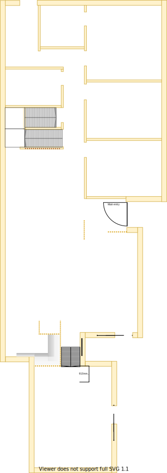

# Section J

## Context
Section J represents the dining area in the lower level as per the original floor plan.

There is/are:
* Two LED downlights installed operating from a dimmer transformer
* Small wall air-conditioner installed on the upper right corner of the west wall
* A sliding door to the kitchen 
* A staircase down to the rumpus/meditaton room

## Problem
1. The wall air-conditioner is old, highly inefficient and only capable of cooling a small area. When turned on the generated cool air moves its way down to the rumpus/meditation room 
2. There is a 2x2m water stain on the carpet near the north sliding door entrance to the kitchen
3. The ceiling plaster board damaged by leaky roof fascia board directly above the room
4. There is no natural lighting and the downlights must be turned on even in daylight
5. The south east window onlooking the verandah extension cavity is pointless

## Solution
1. Renew room and remove all unneccessary doors, walls, windows and closed spaces to create an open floor plan

|As-is Section J model| To-be Section J model|
|---|---|
|||
Table LL-G1: AS-IS & TO-BE Section J model comparison

## Requirements
|ID|Description|Est. Cost|Additinal Preference Cost|
|---|---|---|--|
|LLI-REQ1|Replace carpet||
|LLI-REQ2|Remove sliding door to kitchen||
|LLI-REQ3|Remove wall to kitchen||
|LLI-REQ4|Upgrade Breamar heating system to include cooling system for central cooling||
|LLI-REQ5|Replace unneccessary south-east window with insulation friendly solution||
|LLI-REQ6|Remove wall air condition unit||
|LLI-REQ7|Replace air conditioner with window if required or plug with rendered cladded foam||
|LLI-REQ8|Replace damaged ceiling plaster board||
|LLI-REQ9|Repaint||
|LLI-REQ10|Replace/repair roof fascia board||
|LLI-REQ11|Replace the downlight dimmer transformer with a standard transformer||

## Known issues
|ID|Description|
|---|---|
|LLI-ISS-1|When inspecting the roof above the closet there is a vertical beam that connects to the ridge where the rafters also connect. This beam appears to run down along the north east corner of the cloak closet (refer photo LLI-photo-1). However, it seems to stop at the floor and is not found underneath the house at that same spot (refer photo LLI-photo-2). Therefore, I'm unsure if this critical load bearing point or not!|

## Photos

Photo: LLI-photo-1

Photo: LLI-photo-2

## Questions
1. Is there any benefit setting the front door back 68cm given that the front door will be entirely replaced?