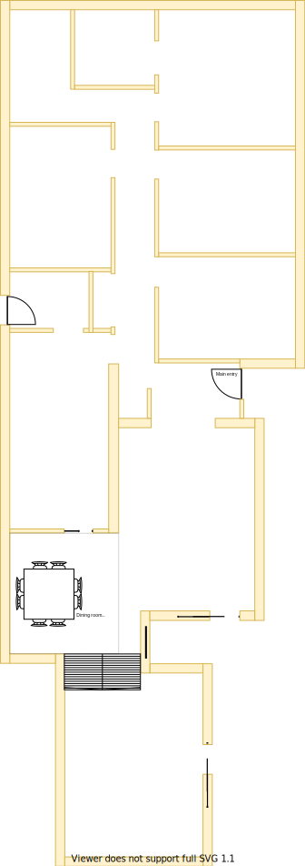

# Section J - Dining

## Context

Section J remains as the dining room located beside the kitchen on the lower level.

Figure LL2: Expected layout

There is/are currently:
* Two LED downlights installed operating from a dimmer transformer
* Small wall air-conditioner installed on the upper right corner of the west wall
* A sliding door to the kitchen 
* A stair case down to the rumpus room
* An outside hatch door for under house access on the south-west corner

## Problem

1. The wall air-conditioner is old, highly inefficient and only capable of cooling a small area. When turned on the generated cool air moves its way down to the rumpus room 
2. There is a 2x2m water stain on the carpet near the north sliding door entrance to the kitchen
3. The ceiling plaster board is damaged by the leaky roof fascia board/gable end vent directly above the room
4. There is no natural lighting and the downlights shall be turned on even in daylight
5. The south east window onlooking the verandah extension cavity is pointless
6. The north most facing downlight frequently experiences flicker despite having change the globe
7. Inequity will arise if there are differences in size, quality and positioning between upper and lower levels

## Solution
1. Keep the dining room in Section J because of the following principles:
    * Embrace value for money first, but select premium if just 20% more than standard pricing
        - Minimising structural changes will reduce costs
    * Reduce overall transit as the basis of location
        - Travel in serving and cleaning up after a meals
    * Rooms/resources that are frequented in terms of time spent/people should attract more space/investment than others
        - Dining areas tend to be under utilised but can share their space with the lounge
2. Choose window positions & sizes that satisfy the following principles in order:
    1. Embrace natural lighting and reduce demand on heating/cooling systems
        - West facing windows invite a lot of heat/sun
    2. Embrace value for money first, but select premium if just 20% more than standard pricing
    3. Symmetry with split occupancy
        - Externally matches the rest of the build structures
    4. No maintenance over low/some maintenance

|Actual|Expected|
|:---:|:---:|
|||

Table LL-G1: Floor plan comparison

## Symmetric Requirements

|ID|Description|Est. Cost|Alternative Solution Cost|
|:---|:---|:---|:---|
|LLJ-REQ1|The dining room shall have an appropriate number of power outlets installed on the east wall|||
|LLJ-REQ2|The dining room shall have an appropriate number of LED downlights|||
|LLJ-REQ3|The dining room shall have consistent non-carpeted flooring as with the entrance, main hall and rumpus room passage to stair case|||
|LLJ-REQ4|The dining room shall be connected to the ducted heating|||
|LLJ-REQ5|The dining room shall have an appropriately sized double glazzed window|||
|LLJ-REQ6|The dining room window shall be able to be opened for ventilation|||
|LLJ-REQ7|The dining room window shall have a fly screen to keep the insects out|||
|LLJ-REQ8|The dining room shall have a fitted night/day internal roller blind with sun/heat block|||
|LLJ-REQ9|The same appliance/fixtures shall have been installed in the same positions as the other dining room|||

## Refurbishing Requirements

|ID|Description|Est. Cost|Alternative Solution Cost|
|:---|:---|:---|:---|
|LLJ-REQ10|Remove north sliding door to kitchen|||
|LLJ-REQ11|Remove north wall to kitchen|||
|LLJ-REQ13|Upgrade Breamar heating system to include cooling system for central cooling|||
|LLJ-REQ13|Replace unneccessary south-east window beside stairs with insulation friendly solution (see also [unneccessary rumpus room window](./section-L-requirements.md))|||
|LLJ-REQ14|Remove wall air condition unit from the north west wall|||
|LLJ-REQ15|Replace air conditioner with window|||
|LLJ-REQ16|Replace/repair roof fascia board/gable end vent above rumpus room stair case|||
|LLJ-REQ17|Replace the downlight dimmer transformer with a standard transformer|||

## Known issues

|ID|Description|
|:---|:---|
|LLJ-ISS-1|When inspecting the roof above the dining room it is clear that the fascia/gable end vent is barely holding together. Unlike the north facing roof fascia/gable end vent, I'm unsure whether this one would have been addressed as part of the upper level build?|

## Questions

* Is it possible to upgrade a ducted heating system to include cooling without complete replacement?
* Are there any issues with removing the north wall that covers the kitchen pantry/cabinets? I kept it in because its connected to the wall that is behind those same cabinet as part of the lounge.
