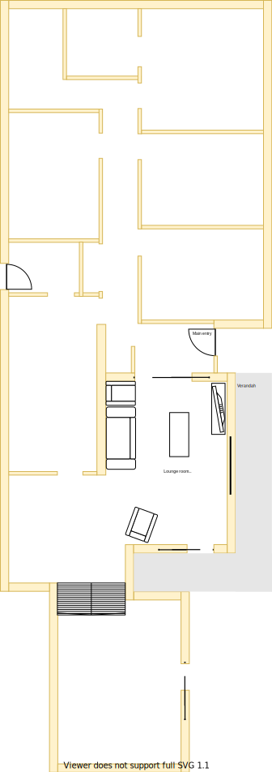

# Section K

## Context

Section K is still the lounge area in the lower level as per the original floor plan.

Figure LL2: TO-BE lower-level sections

There is/are:
* Four downlights installed operating from dimmer transformer
* A old style home theatre setup installed
* A sliding door & wall on the north to main entrance & hall
* A south facing sliding door to the verandah and deck
* A ducted heating vent beside the east window

## Problem

1. The horizontal stud behind the plaster board of the west wall [behind the kitchen cabinet](./section-H-requirements.md) is noticibly visible as the plaster board has bent around following the contour of the stud 
2. There is no cooling system in this room but it gets some comfort from the [wall A/C in the adjacent dining room](./section-J-requirements.md)
3. The current window frame is old, large and difficult to open behind the fly screen
4. There are two UHF TV Antenna ports which connect to different external aerials (which are both installed at [the north side of the house](./section-A-requirements.md))
5. There are four cat5 ports that connect to the [original office room](./section-E-requirements.md)
6. There is 15+ year old projector installed on the ceiling with old RCA/VGA wiring that is connected to the bracket
7. There is a large projector screen installed on the east side above the window
8. In the summer, heat enters the room through the large windows on the east and the large windows on the south sliding doors to the deck. There is a lot of afternoon light reflected from the fencing on the east
9. There is a halogen downlight dimmer transformer installed
10. The north-east most facing downlight frequently experiences flicker despite having change the globe

## Solution

1. Remove all old technology, wiring and/ore housing
2. Use double glazzed windows on all large windowing surfaces

|As-is Section K model| Expected floor plan for K model|
|:---:|:---:|
|||

Table LL-K1: AS-IS & Expected floor plan for K model comparison

## Requirements

|ID|Description|Est. Cost|Alternative Solution Cost|
|:---|:---|:---|:---|
|LLK-REQ1|Replace carpet|||
|LLK-REQ2|Replace window & frame with double glazzed product|||
|LLK-REQ3|Replace sliding door windows with double glazzing exising frames product|||
|LLK-REQ4|Replace curtains with fitted night/day blinds|||
|LLK-REQ5|Replace east & west powerpoints outlets with more sockets|||
|LLK-REQ6|Repaint|||
|LLK-REQ7|Install ceiling fan|||
|LLK-REQ8|Replace ducted heating vent|||
|LLK-REQ9|Remove cat5 port bracket and cables to [original office room](./section-E-requirements.md)|||
|LLK-REQ10|Remove secondary UHF TV port bracket and splitter to port|||
|LLK-REQ11|Replace diming downlight  transformer with standard transformer|||
|LLK-REQ12|Remove RCA/VGA port brackets & wiring from east wall that connects to ceiling|||
|LLK-REQ13|Remove projector and mounting harness from ceiling|||
|LLK-REQ14|Remove projector screen and mount points|||
|LLK-REQ15|Replace plaster board where required|||

## Known issues

|ID|Description|
|:---|:---|
|LLK-ISS-1|The large window frames openings will likely need to be filled with foamed clad and rendered to achieve a similar look & feel to the upper level. Seek Brett's advice on window transition plan|
|LLK-ISS-2|Need to investigate whether we dedicate one TV aerial per level as there is not signal repeaters installed and splitting reduces the single strength. Note, there are currently four split ports installed throughout the house|