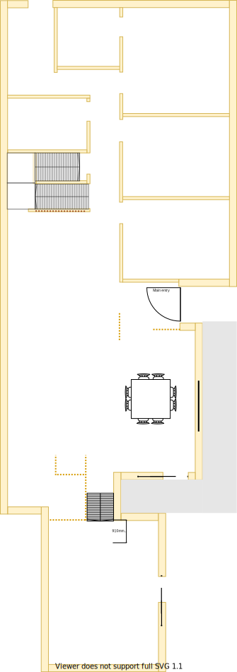

# Section K

## Context
Section K is the lounge in the lower level as per the original floor plan.
There is/are:
* Four downlights installed operating from dimmer transformer
* A old style home theatre setup installed
* Sliding door & wall on the north to main entrance & hall
* A ducted heating vent beside the east window

## Problem
1. The horizontal stud behind the plaster board of the west wall is noticibly visible following the contour of the stud 
2. There is no cooling system in this room but it shared by the wall A/C in the adjacent dining room
3. The current window frames are old, large and difficult to open behind the fly screen
4. There are two UHF TV Antenna ports which connect to different external aerials
5. There are four cat5 ports that connect to the original office room
6. There is 15+ year old projector installed on the ceiling with old RCA/VGA wiring to the bracket
7. There is a large projector screen installed on the east side above the window
8. In the summar heat enters the room through the large windows on the east and the large windows on the south sliding doors to the deck
9. There is a Halogen downlight dimmer transformer installed

## Solution
1. Remove all old technology and wiring
2. Use double glazzed windows on all large windowing surfaces

|As-is Section K model| To-be Section K model|
|---|---|
|||
Table LL-K1: AS-IS & TO-BE Section K model comparison

## Requirements
|ID|Description|Est. Cost|Additinal Preference Cost|
|---|---|---|--|
|LLK-REQ1|Replace carpet||
|LLK-REQ2|Replace window & frame with double glazzed product||
|LLK-REQ3|Replace sliding door windows with double glazz exising frames product||
|LLK-REQ4|Replace curtains with fitted night/day blinds||
|LLK-REQ5|Replace east & west powerpoints outlets with more sockets||
|LLK-REQ6|Repaint||
|LLK-REQ7|Install ceiling fan||
|LLK-REQ8|Replace ducted heating vent||
|LLK-REQ9|Remove cat5 port bracket and cables to study||
|LLK-REQ10|Remove secondary UHF TV port bracket and splitter to port||
|LLK-REQ11|Replace diming downlight  transformer with standard transformer
|LLK-REQ12|Remove RCA/VGA port brackets & wiring from east wall that connects to ceiling
|LLK-REQ13|Remove projector and mounting harness from ceiling
|LLK-REQ14|Remove projector screen and mount points

## Known issues
|ID|Description|
|---|---|
|LLK-ISS-1|The large window frames openings will likely need to be filled with foamed clad and rendered to achieve a similar look & feel to the upper level. Seek Brett's advice on window transition plan|