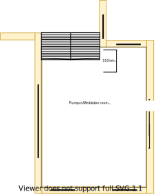
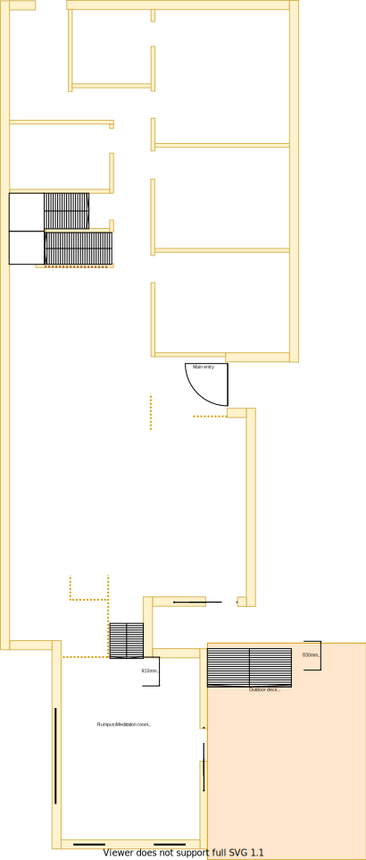

# Section L - Rumpus room [Shared Resource]

## Context

Section L remains as the Rumpus room on the lower level. 

The rumpus room is located in the south end of the house where the land slopes significantly. This split level is almost 1m lower than the rest of the house. It was the biggest extension that I think that the previous owners were able to make.

There is/are currently:
* Two ducted heating vents installed by the south and east walls
* Four LED downlights installed and centrally positioned
* Windows on every side all but one of them have hand winders
* A UHF TV Antenna port on the north east wall
* A sliding door on the east side which connects to the deck
* A large outside stair case from the verandah to the north side of the deck

## Problem

1. The room is cool in summer but very cold in winter
2. The stair case is bulky and dated
3. The north facing window is pointless with a view to the extension cavity area
4. In the summer the heat enters the room through the east and south sides by the light bouncing off the fencing on the east side 
5. The outdoor deck stair case has a faulty step and is currently held in position using a hydrolic oil jack 

## Solution

1. Renew room and stair case
2. Choose window position & size that satisfy the following principles in order:
    1. Embrace natural lighting and reduce demand on heating/cooling systems
        - West facing windows invite a lot of heat/sun
    2. Embrace value for money first, but select premium if just 20% more than standard pricing
        - Avoid structural changes to reduce costs
    3. Symmetry with split occupancy
        - Externally matches the rest of the build structures
    4. No maintenance over low/some maintenance

|Actual|Expected|
|:---:|:---:|
|||

Table LL-L1: Floor plan comparison

## Requirements

|ID|Description|Est. Cost|Alternative Solution Cost|
|:---|:---|:---|:---|
|LLL-REQ1|The rumpus room must have a stair case that matches the [multi-level stair case](./section-DF-requirements.md)|||
|LLL-REQ2|The rumpus room must have carpet/fixtures/furnishings that are consistent with the rest of the house|||
|LLL-REQ3|The rumpus room must have double glazzed windows|||
|LLL-REQ4|The rumpus room windows must be able to be opened for ventilation|||
|LLL-REQ5|The rumpus room windows must have a fly screen to keep the insects out|||
|LLL-REQ6|The rumpus room windows must have a fitted night/day internal roller blind with sun/heat block|||
|LLL-REQ7|The rumpus room's sliding door windows are be replaced with double glazzing product for exising frames|||
|LLL-REQ8|The rumpus room must be repainted|||
|LLL-REQ9|The rumpus room must have a ceiling fan|||
|LLL-REQ10|The rumpus room's existing ducted heating vents must be replaced|||
|LLL-REQ11|The rumpus room's north window facing window must be covered with some solution to improve temperature management|||
