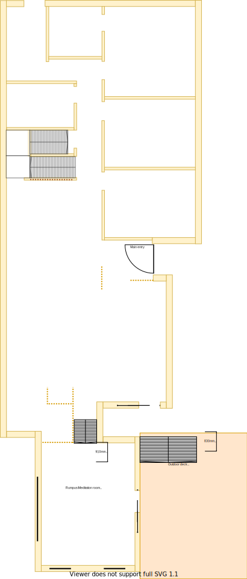

# Section L - Rumpus room [Shared Resource]

## Context

Section L remains as the Rumpus room on the lower level. 

The rumpus room is located in the south end of the house where the land slopes significantly. This split level is almost 1m lower than the rest of the house. It was the biggest extension that I think that the previous owners were able to make.

There is/are currently:
* A stair case from the dining area to the rumpus room. A thermal curtain has been placed around the stair case to try and retain heat
* Two ducted heating vents installed by the south and east walls
* Four LED downlights installed and centrally positioned
* Windows on every side and all but one of them have hand winders
* A UHF TV Antenna port on the north east wall
* A sliding door on the east side which connects to the deck
* A large outside stair case from the verandah to the north side of the deck
* West facing windows which invite a lot of heat/sun

## Problem

1. The room is cool in summer but very cold in winter
2. The stair case is bulky and dated
3. The north facing window is pointless with a view to the extension cavity area
4. In the summer the heat also enters the room through the east and south sides by the light bouncing off the fencing on the east side 
5. The outdoor deck stair case has a faulty step and is currently held in position using a red hydrolic oil jack 

## Requirements

|ID|Description|Est. Cost|Alternative Solution Cost|
|:---|:---|:---|:---|
|LLL-REQ1|The rumpus room shall have a stair case that matches the [multi-level stair case](./section-DF-requirements.md)|||
|LLL-REQ2|The rumpus room shall have carpet/fixtures/furnishings that are consistent with the rest of the house|||
|LLL-REQ3|The rumpus room shall have double glazzed windows|||
|LLL-REQ4|The rumpus room windows shall be able to be opened for ventilation|||
|LLL-REQ5|The rumpus room windows shall have a fly screen to keep the insects out|||
|LLL-REQ6|The rumpus room windows shall have a fitted night/day internal roller blind with sun/heat block|||
|LLL-REQ7|The rumpus room's sliding door windows shall be replaced with double glazzing product for exising frames|||
|LLL-REQ9**|The rumpus room shall have a ceiling fan|||
|LLL-REQ10**|The rumpus room's existing ducted heating vents shall be replaced|||
|LLL-REQ11**|The rumpus room's north window facing window shall be covered with some solution to improve temperature management|||
|LLL-REQ12|The rumpus room shall be refurbished to as new condition|||

** - Optional requirement which may prove unnecessary given the situation

## Solution

|Actual|Expected|
|:---:|:---:|
|||

Table LL-L1: Floor plan comparison

Note, the only key difference between the two diagrams in the table above is the removal of the window beside the stair case.

|Design principles|
|:---|
|Embrace value for money first, but select premium if just 20% more than standard pricing|
|Embrace natural lighting and reduce demand on heating/cooling systems|

Table LL-L2: The design principles that should be influencing the solution's location/choices/decisions

### Steps
1. Refurbish rumpus room in line with the rest of the house
2. Rebuild stair case in line with multi-level stair case

### Considerations
1. LLL-REQ9 & LLL-REQ10
    - Subject to the decision on centralised heating & cooling option selected
2. LLL-REQ11
    - Choose the cheaper of filling & covering in the window internally & externally or applying double glazzing

## Photos

Photo: LLL-photo-1 - bulky stair case

Photo: LLL-photo-2 - large windowesliding doors

Photo: LLL-photo-3 - outside deck stair case

## References
1. Carpet Tiles 1
    - https://www.carpettiles1.com.au/carpet-tiles/product-details/matin-dark-tan-brown--model:cpt-393
