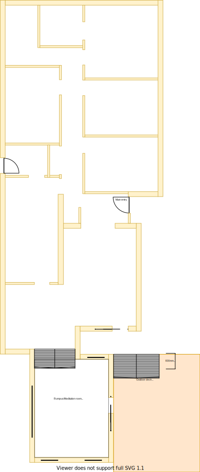

# Section L

## Context

Section L is still the Rumpus/Meditation room in the lower level as per the original floor plan. 

The rumpus/meditation room is located in the south end of the house where the land slopes significantly. This split level is almost 1m lower than the rest of the house. It was the biggest extension that I think that the previous owners were able to make.

There is/are:
* Two ducted heating vents installed by the south and east walls
* Four LED downlights installed and centrally positioned
* Windows on every side and all of them have hand winders
* A UHF TV Antenna port on the north side
* A sliding door on the east side which  connects to the deck
* A large staircase from the verandah to the north side of the deck

## Problem

1.  The room is cool in summer but very cold in winter
2. The staircase is bulky and dated
3. The north facing window is pointless with a view to the extension cavity area
4. In the summar the heat enters the room through the east and south sides by the light bouncing off the fencing on the east side 
5. The third step in the external deck staircase has a faulty step and is currently held in position using a hydrolic oil jack 

## Solution

1. Renew room and staircase
2. Use double glazzed windows on all windowing surfaces with better fitted day/night blinds

|As-is Section L model| To-be Section L model|
|:---:|:---:|
|||

Table LL-L1: AS-IS & TO-BE Section L model comparison

## Requirements

|ID|Description|Est. Cost|Additinal Preference Cost|
|:---|:---|:---|:---|
|LLL-REQ1|Replace staircase with one that matches the [multi-level staircase](./section-DF-requirements.md)|||
|LLL-REQ1|Replace carpet|||
|LLL-REQ2|Replace window & frame with double glazzed product|||
|LLL-REQ3|Replace sliding door windows with double glazzing to exising frames product|||
|LLL-REQ4|Replace curtains with fitted night/day blinds|||
|LLL-REQ5|Replace powerpoints outlets with more sockets|||
|LLL-REQ6|Repaint|||
|LLL-REQ7|Install ceiling fan|||
|LLL-REQ8|Replace ducted heating vents|||
|LLL-REQ9|Remove/replace north window with some solution to improve temperature management|||

## Known issues

|ID|Description|
|:---|:---|
|LLL-ISS-1|The large window frames openings will likely need to be filled with foamed clad and rendered to achieve a similar look & feel to the upper level. Seek Brett's advice on window transition plan|