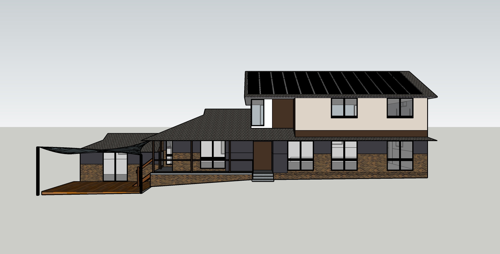
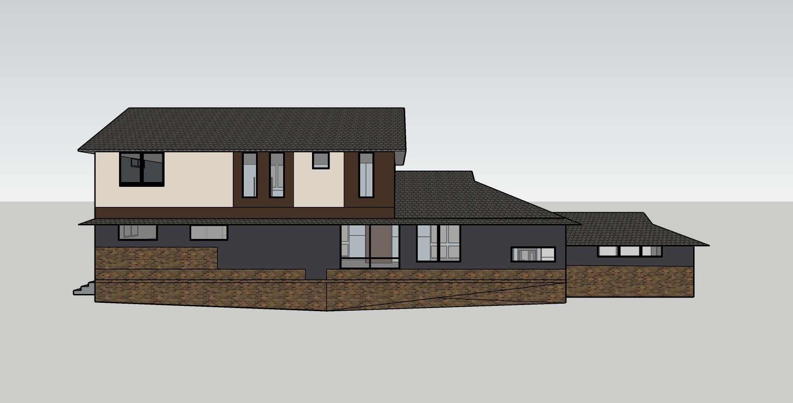

# Section X - east facing west & west facing east

## Context

Section X captures those requirements on the boundary with reference to wall and windows with external interfaces from the east and west perspectives.

Figure OL-X1: Expected east facing west view

Figure OL-X2: Expected west facing east view

## Problem

1. The old 70's building facade needs a contemporary refresh that achieves a balanced fusion of the classic and modern styles
2. Changing the window wall openings sizes will increase the build cost
3. New windows on the upper rooms must avoid an external jarring effect. Further a balance of symmetry and asymmetry for features effect
4. Flat foam insulated cladding has been used to achieve a modern effect
5. Multiple rendered color schemes have been used to achieve greater consistency with other building sides where the removed windows/doors have been filled in with cladding