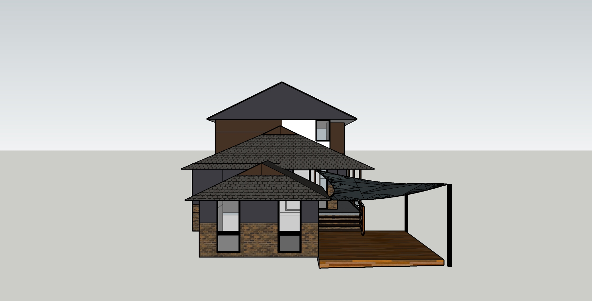
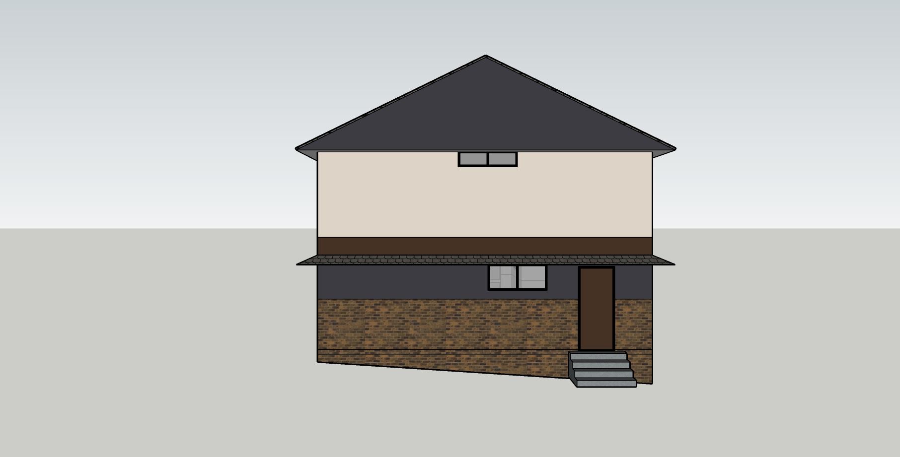

# Section Y - north facing south & south facing north

## Context

Section Y captures those requirements on the boundary with reference to wall and windows with external interfaces from the north and south perspectives.

Figure OL-Y1: Expected north facing south view

Figure OL-Y2: Expected south facing north view

## Problem

1. Due to lack of symmetry with respect to the master bedroom on the upper level and the lower level the tall full length window in the corner of the room was selected. However, this would limit the amount of natural light entring into the room in the late afternoon. To overcome this a south facing window has been added to the corner in order to capture additional light
2. New windows on the upper rooms must avoid an external jarring effect. Further a balance of symmetry and asymmetry for features effect
3. Flat foam insulated cladding has been used to achieve a modern effect
4. Multiple rendered color schemes have been used to achieve greater consistency with other building sides where the removed windows/doors have been filled in with cladding