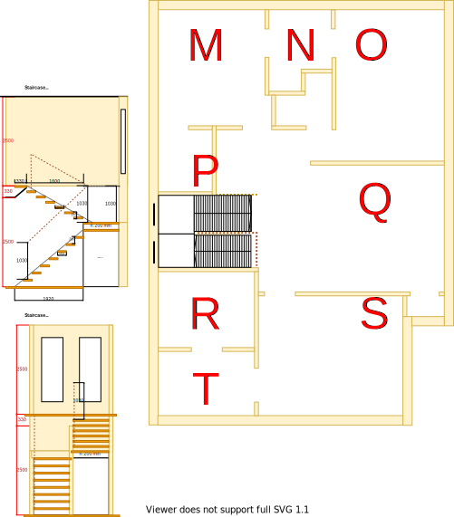

# Upper-Level Requirements

The Upper-Level refers to the new building structure that has been inserted between the lower-level and the roof of the original building.

With the lower-level requirements the scope was defined as the gap between the Actual view and the Expected view. With the upper-level requirements there is no existing building structure state, therefore all views and requirements form the the scope.

To avoid confusion of room names with the lower-level, new section labels have been assigned as the basis of organising these requirements. The sections will again continue in alphabetical order this time starting from 'M'.

|Expected layout|Expected floor plan|
|:---:|:---:|
|||

Table UL1: Expected layout and floor plan

Using the above diagrams as a guide, visit each link in the Upper-Level Section Requirements table below to assess the complete set of requirements for the upper-level.

|Section Group|Expected|
|:---|:---|
|[Section M](./section-M-requirements.md)|Main Bathroom|
|[Section N](./section-N-requirements.md)|Ensuite|
|[Section O](./section-O-requirements.md)|Master bedroom|
|[Section P](./section-P-requirements.md)|Study|
|[Section Q](./section-Q-requirements.md)|2nd bedroom|
|[Section R](./section-R-requirements.md)|1st bedroom|
|[Section S](./section-S-requirements.md)| Dining|
|[Section T](./section-T-requirements.md)|Lounge|

Table UL2: Upper-Level Section Requirements
