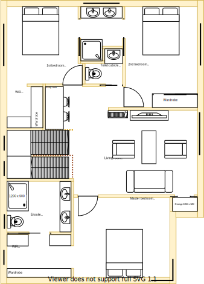

# Upper-Level Requirements

The Upper-Level refers to the new building structure that has been inserted between the lower-level and the roof of the original building.

With the lower-level requirements the scope was defined as the gap between the AS-IS model and the TO-BE model. With the upper-level requirements there is no existing building structure state, therefore the entire model and requiements is the scope.

To avoid confusion of room names with the lower-level, new section group names have been assigned as the basis of organising these requirements. The sections will again continue in alphabetical order starting from 'M'.

|To-be wall/section model|To-be floor plan model|
|:---:|---:|
|||

Table UL1: TO-BE wall/section model & floor plan

Using the above diagrams as a guide, visit each link in the Section Requirements table below to assess the complete set of requirements for the upper-level.

|Section Group|TO-BE (Planned)|
|:---|:---|
|[Section M](./section-M-requirements.md)|Main Bathroom|
|[Section N](./section-N-requirements.md)|Ensuite|
|[Section O](./section-O-requirements.md)|Master bedroom|
|[Section P](./section-P-requirements.md)|Study|
|[Section Q](./section-Q-requirements.md)|2nd bedroom|
|[Section R](./section-R-requirements.md)|1st bedroom|
|[Section S](./section-S-requirements.md)| Dining|
|[Section T](./section-T-requirements.md)|Lounge|

Table UL2: Section Requirements

## Symmetry
Figure UL1 outlines the general wall sectioning of the upper level. To a great extent there is intentional architectural symmetry with the lower-level. That is, most room configurations are mirrored in size, position and characteristics of its lower-level counterpart. In terms of personal space both levels occupy the same total surface area, thus making each level equally equitable for future tenants/families to split in order to cohabit the dwelling.

|Room|Symmetrical aspect|Lower Level|Upper Level|
|---|---|---|---|
|Master bedroom ensuite|same position & same size|[Section B](../lower/section-B-requirements.md)|[Section M](./section-M-requirements.md)|
|Master bedroom|same position & same size|[Section C](../lower/section-C-requirements.md)|[Section N](./section-N-requirements.md)|
|2nd bedroom|same position & same size|[Section E](../lower/section-E-requirements.md)|[Section Q](./section-Q-requirements.md)|
|1st bedroom|same position & same size|[Section G](../lower/section-G-requirements.md)|[Section R](./section-R-requirements.md)|
|Main bathroom|similar position & similar size|[Section DF](../lower/section-DF-requirements.md)|[Section A](./section-A-requirements.md)|
|Dining|similar position & same size|[Section J](../lower/section-J-requirements.md)|[Section S](./section-S-requirements.md)|
|Lounge|similar position & similar size|[Section K](../lower/section-K-requirements.md)|[Section T](./section-T-requirements.md)|
|Kitchen|shared|[Section H](../lower/section-H-requirements.md)||
|Laundry|shared|[Section A](../lower/section-A-requirements.md)||
|Study|shared||[Section P](./section-P-requirements.md)|
|Rumpus|shared||[Section L](./section-L-requirements.md)|
