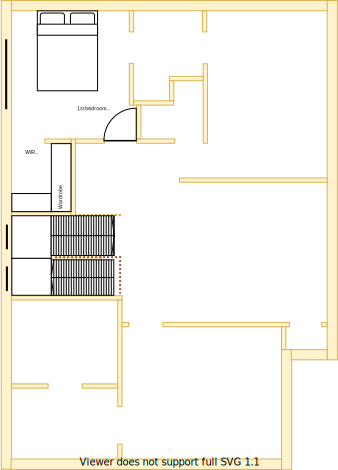

# Section M - Main bathroom

## Context

Section M will be the main bathroom on the upper level.

Figure UL1: TO-BE upper-level sections

Figure UL-M1: TO-BE Section M model 

## Problem

1. The Symmetry principle has been violated because the laundry must be placed in this position on the lower level 

## Solution

1. Locate main bathroom in section M because of the following principles:
  * Rooms/resources that are frequented in terms of time spent/people should attract more space/investment than others
  * Reduce overall transit as the basis of location
2. Choose appliances and fixtures that satisfy the following principles in order:
    1. Symmetry with split occupancy 
      * Both lower & upper should have the same quality and fittings
    2. Embrace value for money first, but select premium if just 20% more than standard pricing
    3. No maintenance over low/some maintenance

## Requirements

|ID|Description|Est. Cost|Alternative Solution Cost|
|:---|:---|:---|:---|
|LLM-REQ1|The bathroom must have an LED light|||
|LLM-REQ2|The bathroom must have a sink|||
|LLM-REQ3|The bathroom must have a toilet|||
|LLM-REQ4|The bathroom must have a cabinet|||
|LLM-REQ5|The bathroom must have heat lamps|||
|LLM-REQ6|The bathroom must have a shower|||
|LLM-REQ7|The bathroom must have a mirror|||
|LLM-REQ8|The bathroom must have a bathtub|||
|LLM-REQ9|The bathroom must have an exhaust fan|||
|LLM-REQ10|The bathroom must be connected to the ducted heating|||
|LLM-REQ11|The same appliance/fixtures have been installed in the other main bathroom|||
|LLM-REQ12|The same appliance/fixtures been installed in similar positions to the other main bathroom (note, difference in size)|||
|LLM-REQ13|The bathroom has an appropriated sized window to embrace natural lighting and reduce demand on heating/cooling|||