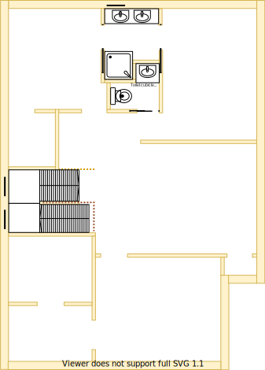

# Section N - Shared bathroom

## Context

Section N will be the main bathroom on the upper level.

Figure UL1: Expected layout

Figure UL-N1: Expected floor plan 

## Problem

1. A bathroom with toilet & shower is required for the two guests rooms & visitors

## Requirements

|ID|Description|Est. Cost|Alternative Solution Cost|
|:---|:---|:---|:---|
|LLN-REQ1|The bathroom shall have an LED downlight|||
|LLN-REQ2|The bathroom shall have a sink with ceramic washer taps|||
|LLN-REQ3|The bathroom shall have an independent cubical toilet|||
|LLN-REQ4|The bathroom shall have a cabinet|||
|LLN-REQ5|The bathroom shall have heat lamps|||
|LLN-REQ6|The bathroom shall have a shower with ceramic washer taps|||
|LLN-REQ7|The bathroom shall have a mirror|||
|~~LLN-REQ8~~|~~The bathroom shall have a bathtub with ceramic washer taps~~|||
|LLN-REQ9|The bathroom shall have an exhaust fan|||
|LLN-REQ10**|The bathroom shall be connected to the ducted heating|||
|LLN-REQ11|The bathroom shall have an appropriately sized double glazed window to embrace natural lighting and reduce demand on heating/cooling|||
|LLN-REQ12|The bathroom window shall be able to be opened for ventilation|||
|LLN-REQ13|The bathroom window shall have a fly screen to keep the insects out|||
|LLN-REQ14**|The bathroom shall have a fitted night/day internal roller blind with sun/heat block|||
|LLN-REQ15|The bathroom's floor shall be tiled|||
|LLN-REQ16|The bathroom shall have power outlets appropriately positioned|||
|LLN-REQ17|The same appliance/fixtures shall have been installed as the other main bathroom except for bathtub|||

## Solution

|Design principles|
|:---|
|Rooms/resources that are frequented in terms of time spent/people should attract more space/investment than others|
|Reduce overall transit as the basis of location|
|Embrace value for money first, but select premium if just 20% more than standard pricing|
|No maintenance over low/some maintenance|

Table UL-N2: The design principles that should be influencing the solution's location/choices/decisions

### Steps

1. Build new main bathroom in section N

### Considerations

1. LLN-REQ10 & LLN-REQ14
    - Subject to the decision on centralised heating & cooling option selected

## References

1. Bunnings
    - https://www.bunnings.com.au/caroma-luna-shelf-wall-basin-with-no-tap-hole_p0184852
    - https://www.bunnings.com.au/estilo-90-x-90-x-190cm-white-acrylic-shower-wall_p4890678
    - https://www.bunnings.com.au/mondella-rococo-shower-screen-chrome_p0036480
    - https://www.bunnings.com.au/mondella-wels-3-star-9l-min-rococo-1-function-rail-shower_p5003327
    - https://www.bunnings.com.au/methven-arrow-shower-mixer_p0057004
    - https://www.bunnings.com.au/mondella-900mm-white-square-resonance-shower-base_p4890568
    - https://www.bunnings.com.au/caroma-wels-4-star-3-5l-min-luna-cleanflush-toilet-suite_p0088812
    - https://www.bunnings.com.au/cibo-design-white-vivid-ceramic-square-counter-top-basin_p4822164
    - https://www.bunnings.com.au/caroma-wels-5-star-6l-min-luna-mid-basin-mixer_p0131571
    - https://www.bunnings.com.au/cibo-design-750mm-white-tonic-full-height-vanity_p0138265
    - https://www.bunnings.com.au/estilo-765mm-metal-shaving-cabinet_p4823199
    - https://www.bunnings.com.au/caroma-600mm-chrome-double-towel-rail_p4820139
    - https://www.bunnings.com.au/caroma-200mm-polished-chrome-cosmo-hand-towel-rail_p4820141
    - https://www.bunnings.com.au/johnson-tiles-500-x-500mm-white-jura-stone-gloss-ceramic-floor-tile-4-pack_p6661693
    - https://www.bunnings.com.au/stylus-1675mm-origin-bath_p4821597
    - https://www.bunnings.com.au/caroma-240mm-chrome-saracom-bath-wall-mixer_p5002670

2. Burdens
    - https://burdensbathrooms.com.au/collections/showers-all-ranges/products/oceano-stonelite-eco-base-900-x-900-rear-outlet-chrome-waste
    - https://burdensbathrooms.com.au/collections/showers-all-ranges/products/aspire-zodiac-ii-chrome-lever-shower-set-cl2034
    - https://burdensbathrooms.com.au/collections/showers-all-ranges/products/oceano-louve-square-pivot-return-screen-900-x-2000-chrome
    - https://burdensbathrooms.com.au/collections/toilets/products/matisse-ii-round-back-to-wall-suite
    - https://burdensbathrooms.com.au/collections/vanities-1/products/aspire-unity-ii-900-vanity-floor-1th-c-w-sq-ceramic-top-whit-rh-d
    - https://burdensbathrooms.com.au/collections/bathroom-tapware/products/millennium-kiato-basin-mixer-chrome
    - https://burdensbathrooms.com.au/collections/mirrors-shaving-cabinets/products/fienza-bevelled-edge-mirror-600-x-750
    - https://burdensbathrooms.com.au/collections/bathroom-accessories/products/aspire-unity-round-single-towel-rail-800mm-chrome-23801
    - https://burdensbathrooms.com.au/collections/bathroom-accessories/products/aspire-zodiac-guest-towel-holder-chrome
    - https://burdensbathrooms.com.au/collections/baths-spa-s/products/oceano-urban-inset-bath-1525-x-800-x-470-white-anti-slip
    - https://burdensbathrooms.com.au/collections/bath-tapware-outlets/products/aspire-zodiac-ii-chrome-bath-set-tp1475
