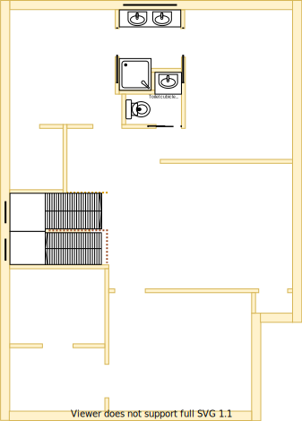

# Section N - Ensuite for the master bedroom

## Context

Section N will be the ensuite for the master bedroom on the upper level.

Figure UL1: Planned level sectioning

Figure UL-N1: Expected floor plan for Ensuite 

## Problem

1. Longevity and resale value will be impacted if the master bedroom lacks an ensuite
2. Inequity will arise if there are differences in size, quality and positioning between upper and lower levels

## Solution

1. Locate ensuite in Section N because of the following principles:
    * Symmetry with split occupancy
        - Equal equity whether on upper or lower levels
    * Rooms/resources that are used together should be adjacent to one another
        - Ensuite is expected to reside adjoining master bedroom
    * Rooms/resources that are frequented in terms of time spent/people should attract more space/investment than others
2. Choose appliances and fixtures that satisfy the following principles in order:
    1. Symmetry with split occupancy 
        - Same quality and fittings whether on upper or lower levels 
    2. Embrace value for money first, but select premium if just 20% more than standard pricing
    3. No maintenance over low/some maintenance
        - External window cleaning will rarely occur

## Requirements

|ID|Description|Est. Cost|Alternative Solution Cost|
|:---|:---|:---|:---|
|LLN-REQ1|The bathroom must have an LED light|||
|LLN-REQ2|The bathroom must have a sink with ceramic washer taps|||
|LLN-REQ3|The bathroom must have a toilet|||
|LLN-REQ4|The bathroom must have a cabinet|||
|LLN-REQ5|The bathroom must have heat lamps|||
|LLN-REQ6|The bathroom must have a shower with ceramic washer taps|||
|LLN-REQ7|The bathroom must have a mirror|||
|LLN-REQ8|The bathroom must have a bathtub with ceramic washer taps|||
|LLN-REQ9|The bathroom must have an exhaust fan|||
|LLN-REQ10|The bathroom must be connected to the ducted heating|||
|LLN-REQ11|The bathroom must have an appropriately sized window to embrace natural lighting and reduce demand on heating/cooling|||
|LLN-REQ12|The bathroom window must be able to be opened for ventilation|||
|LLN-REQ13|The bathroom window must have a fly screen to keep the insects out|||
|LLN-REQ14|The bathroom must have a fitted night/day internal roller blind with sun/heat block|||
|LLN-REQ15|The bathroom's floor must be tiled|||
|LLN-REQ16|The bathroom must have power outlets appropriately positioned|||
|LLN-REQ17|The same appliance/fixtures must have been installed in the same positions as the other ensuite|||
