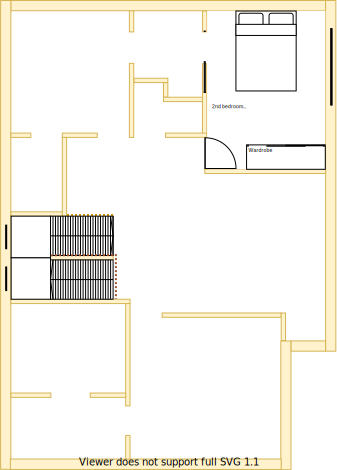

# Section O - Master bedroom

## Context

Section O will be the master bedroom on the upper level.

Figure UL1: Expected layout

Figure UL-O1: Expected floor plan

## Problem

1. Longevity and resale value will be impacted if there was no master bedroom
2. Inequity will arise if there are differences in size, quality and positioning between upper and lower levels

## Solution

1. Locate master bedroom in Section O because of the following principles:
    * Symmetry with split occupancy
        - Equally equitable whether on the upper or lower levels
    * Reduce overall transit as the basis of location
        - Close proximity to all resources
    * Rooms/resources that are used together should be adjacent to one another
        - Close proximity to stairs, and study
    * Rooms/resources that are frequented in terms of time spent/people should attract more space/investment than others
2. Choose appliances and fixtures that satisfy the following principles in order:
    1. Symmetry with split occupancy 
        - Same quality and fittings whether on upper or lower levels 
    2. Embrace value for money first, but select premium if just 20% more than standard pricing
    3. No maintenance over low/some maintenance
        - External window cleaning will rarely occur

## Requirements

|ID|Description|Est. Cost|Alternative Solution Cost|
|:---|:---|:---|:---|
|LLO-REQ1|The bedroom shall have an efficient/effective wardrobe that maximises space|||
|LLO-REQ2|The bedroom shall have an appropriate number of LED downlights|||
|LLO-REQ3|The bedroom shall have a UHF TV port socket installed and connected to the external aerial|||
|LLO-REQ4|The bedroom shall be carpeted|||
|LLO-REQ5|The bedroom shall have an appropriately sized double glazzed window|||
|LLO-REQ6|The bedroom shall have a ducted heating vent|||
|LLO-REQ7|The bedroom shall have a fitted night/day internal roller blind with sun/heat block|||
|LLO-REQ8|The bedroom shall have power outlets appropriately positioned on the north east, north west and south east sides|||
|LLO-REQ9|The bedroom shall have a centrally installed ceiling fan|||
|LLO-REQ10|The same appliance/fixtures shall have been installed in the same positions as the other master bedroom|||

## Preferences

1. There should be one large full size mirror available on each level