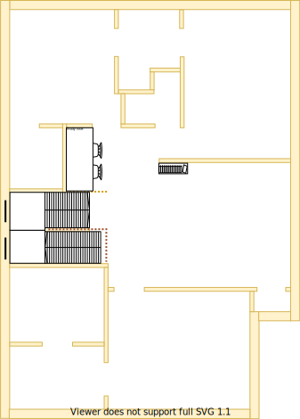

# Section P - Study [Shared Resource]

## Context

Section P will be the study which is a shared resource. The study is located by the multi-level stair case on the upper level.

The study is designed to be an open space. It will likely host a printer and filing cabinet. Residents should be work together around a table

Figure UL1: TO-BE upper-level sections

Figure UL-P1: TO-BE Section P model 

## Problem

* Not Applicable

## Solution

1. Locate Study in Section P because of the following principles:
  * Centralise shared building services/resources
  * Rooms/resources that are frequented in terms of time spent/people should attract more space/investment than others
  * Reduce overall transit as the basis of location

## Requirements

|ID|Description|Est. Cost|Alternative Solution Cost|
|:---|:---|:---|:---|
|LLP-REQ1|The study must have an appropriate number of poweroutlets installed on the north and east wall to power a printer, multiple laptops and other devices|||
|LLP-REQ2|The study must have an appropriate number of LED lights|||
|LLP-REQ3|The study must be carpeted|||
|LLP-REQ4|The bedroom must have an appropriately sized double glazzed window|||

## Question

1. Brett, should the open study have a ducted heating vent?