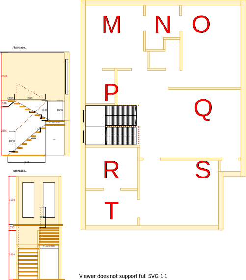

# Section Q - Lounge

## Context

Section Q will be the lounge room on the upper level.

Figure UL1: Expected layout

Figure UL-Q1: Expected floor plan

## Problem

1. An autonomous entertainment area is required for upper level occupants

## Requirements

|ID|Description|Est. Cost|Alternative Solution Cost|
|:---|:---|:---|:---|
|LLQ-REQ1|The lounge room shall have an appropriate number of power outlets installed near each corner|||
|LLQ-REQ2|The lounge room shall have an appropriate number of LED downlights|||
|LLQ-REQ3|The lounge room shall be carpeted|||
|~~LLQ-REQ4~~|~~The lounge room shall be connected to the ducted heating~~|||
|LLQ-REQ5|The lounge room shall have an appropriately sized double glazed windows|||
|LLQ-REQ6|The lounge room windows shall be able to be opened for ventilation|||
|LLQ-REQ7|The lounge room windows shall have a fly screen to keep the insects out|||
|LLQ-REQ8|The lounge room shall have a fitted night/day internal roller blinds with sun/heat block|||
|LLQ-REQ9**|The lounge room shall have a centrally installed ceiling fan|||
|LLQ-REQ10|The lounge room shall have a UHF TV connection and a cat5 connection to the staircase storage|||
|LLQ-REQ11|The same appliance/fixtures shall have been installed as with the other lounge room|||

## Solution

|Design principles|
|:---|
|Embrace value for money first, but select premium if just 20% more than standard pricing|
|Embrace natural lighting and reduce demand on heating/cooling systems|
|Rooms/resources that are used together should be adjacent to one another|
|Rooms/resources that are frequented in terms of time spent/people should attract more space/investment than others|
|No maintenance over low/some maintenance|

Table UL-Q2: The design principles that should be influencing the solution's location/choices/decisions

### Steps

1. Build new lounge room in Section Q

### Considerations

1. LLQ-REQ4 & LLQ-REQ9
    - Subject to the decision on centralised heating & cooling option selected

## References

1. Carpet Tiles 1
    - https://www.carpettiles1.com.au/carpet-tiles/product-details/matin-dark-tan-brown--model:cpt-393