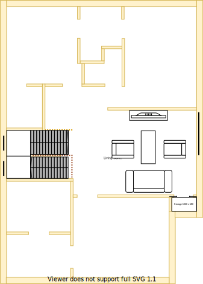

# Section Q - 2nd bedroom

## Context

Section Q will be the 2nd bedroom on the upper level.

Figure UL1: Expected layout

Figure UL-Q1: Expected floor plan

## Problem

1. Longevity and resale value will be impacted if there are less than three rooms
2. Inequity will arise if there are differences in size, quality and positioning between upper and lower levels

## Requirements

|ID|Description|Est. Cost|Alternative Solution Cost|
|:---|:---|:---|:---|
|LLQ-REQ1|The bedroom shall have an efficient/effective wardrobe that maximises space|||
|LLQ-REQ2|The bedroom shall have an appropriate number of LED downlights appropriately positioned|||
|LLQ-REQ3|The bedroom shall be carpeted|||
|LLQ-REQ4|The bedroom shall have an appropriately sized double glazzed window|||
|LLQ-REQ5**|The bedroom shall have a ducted heating vent|||
|LLQ-REQ6|The bedroom shall have a fitted night/day internal roller blind with sun/heat block|||
|LLQ-REQ7**|The bedroom shall have a centrally installed ceiling fan|||
|LLQ-REQ8|The bedroom shall have power outlets appropriately positioned near each corner|||
|LLQ-REQ9|The same appliance/fixtures shall have been installed in the same positions as the other 1st & 2nd bedrooms for both levels|||

## Solution

|Design principles|
|:---|
|Embrace value for money first, but select premium if just 20% more than standard pricing|
|No maintenance over low/some maintenance|
|Symmetry with split occupancy|
|Reduce overall transit as the basis of location|
|Rooms/resources that are used together should be adjacent to one another|
|Rooms/resources that are frequented in terms of time spent/people should attract more space/investment than others|

Table UL-Q2: The design principles that should be influencing the solution's location/choices/decisions

### Steps

1. Build new 2nd bedroom in Section Q 

### Considerations

1. LLQ-REQ5 & LLQ-REQ7
    - Subject to the decision on centralised heating & cooling option selected

## References

1. Carpet Tiles 1
    - https://www.carpettiles1.com.au/carpet-tiles/product-details/matin-dark-tan-brown--model:cpt-393