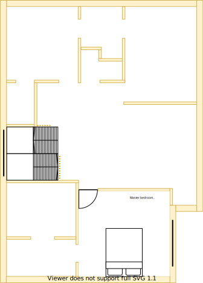

# Section S - Dining

## Context

Section S will be the dining room located beside the multi-level stair case on the upper level.

Figure UL1: Expected layout

Figure UL-S1: Expected floor plan

## Problem

1. An autonomous area is required for split residents to dine separately
2. Inequity will arise if there are differences in size, quality and positioning between upper and lower levels

## Solution

1. Locate dining room in Section S because of the following principles:
    * Reduce overall transit as the basis of location
        - Travel in serving and cleaning up after a meals
    * Rooms/resources that are frequented in terms of time spent/people should attract more space/investment than others
        - Dining areas tend to be under utilised but can share their space with the lounge
2. Choose window positions & sizes that satisfy the following principles in order:
    1. Embrace natural lighting and reduce demand on heating/cooling systems
        - West facing windows invite a lot of heat/sun
    2. Embrace value for money first, but select premium if just 20% more than standard pricing
    3. Symmetry with split occupancy
        - Externally matches the rest of the build structures
    4. No maintenance over low/some maintenance
        - External window cleaning will rarely occur

## Requirements

|ID|Description|Est. Cost|Alternative Solution Cost|
|:---|:---|:---|:---|
|LLS-REQ1|The dining room must have an appropriate number of power outlets installed on the east wall|||
|LLS-REQ2|The dining room must have an appropriate number of LED downlights|||
|LLS-REQ3|The dining room must have the same non-carpeted flooring with the study and hall|||
|LLS-REQ4|The dining room must be connected to the ducted heating|||
|LLS-REQ5|The dining room must have an appropriately sized double glazzed window|||
|LLS-REQ6|The dining room window must be able to be opened for ventilation|||
|LLS-REQ7|The dining room window must have a fly screen to keep the insects out|||
|LLS-REQ8|The dining room must have a fitted night/day internal roller blind with sun/heat block|||
|LLS-REQ9|The same appliance/fixtures must have been installed in similar positions as the other dining room|||
