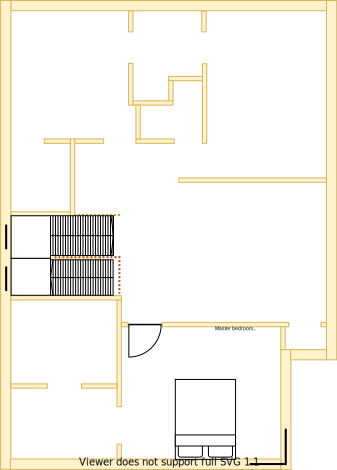

# Section S - Dining

## Context

Section S will be the dining room located beside the multi-level stair case on the upper level.

Note that west facing windows if installed can invite a lot of heat & light.

Figure UL1: Expected layout

Figure UL-S1: Expected floor plan

## Problem

1. An autonomous area is required for split residents to dine separately
2. Inequity will arise if there are differences in size, quality and positioning between upper and lower levels

## Requirements

|ID|Description|Est. Cost|Alternative Solution Cost|
|:---|:---|:---|:---|
|LLS-REQ1|The dining room shall have an appropriate number of power outlets installed on the east wall|||
|LLS-REQ2|The dining room shall have an appropriate number of LED downlights|||
|LLS-REQ3|The dining room shall have the same tiled flooring as the hall|||
|LLS-REQ4**|The dining room shall be connected to the ducted heating|||
|LLS-REQ5|The dining room shall have an appropriately sized double glazed window|||
|LLS-REQ6|The dining room window shall be able to be opened for ventilation|||
|LLS-REQ7|The dining room window shall have a fly screen to keep the insects out|||
|LLS-REQ8|The dining room shall have a fitted night/day internal roller blind with sun/heat block|||
|LLS-REQ9|The same appliance/fixtures shall have been installed in similar positions as the other dining room|||

## Solution

|Design principles|
|:---|
|Embrace value for money first, but select premium if just 20% more than standard pricing|
|Embrace natural lighting and reduce demand on heating/cooling systems|
|Reduce overall transit as the basis of location|
|Rooms/resources that are frequented in terms of time spent/people should attract more space/investment than others|
|No maintenance over low/some maintenance|
|Symmetry with split occupancy|
|Rooms/resources that are used together should be adjacent to one another|

Table UL-S2: The design principles that should be influencing the solution's location/choices/decisions

### Steps

1. Build new dining room in Section S

### Considerations

1. LLS-REQ4
    - Subject to the decision on centralised heating & cooling option selected

## References

1. Bunnings
    - https://www.bunnings.com.au/senso-urban-914-x-152-x-2mm-2-20m-whitetech-self-adhesive-vinyl-planks-16-pack_p6600075