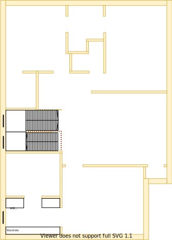

# Section T - Lounge

## Context

Section T will be the lounge room on the upper level.

Figure UL1: Expected layout

Figure UL-S1: Expected floor plan

## Problem

1. An autonomous area is required for split residents to entertain separately
2. Inequity will arise if there are differences in size, quality and positioning between upper and lower levels

## Solution

1. Locate lounge room in Section T because of the following principles:
    * Rooms/resources that are frequented in terms of time spent/people should attract more space/investment than others
        - Lounge areas are often highly utilised areas in the house
    * Rooms/resources that are used together should be adjacent to one another
        - Lounge areas can pull in the space and resources of the dining area
    * Symmetry with split occupancy
        - Equally equitable whether on the upper or lower levels
2. Choose window positions & sizes that satisfy the following principles in order:
    1. Embrace natural lighting and reduce demand on heating/cooling systems
        - West facing windows invite a lot of heat/sun
    2. Embrace value for money first, but select premium if just 20% more than standard pricing
    3. Symmetry with split occupancy
        - Externally matches the rest of the build structures
    4. No maintenance over low/some maintenance
        - External window cleaning will rarely occur

## Requirements

|ID|Description|Est. Cost|Alternative Solution Cost|
|:---|:---|:---|:---|
|LLT-REQ1|The lounge room shall have an appropriate number of power outlets installed near each corner|||
|LLT-REQ2|The lounge room shall have an appropriate number of LED downlights|||
|LLT-REQ3|The lounge room shall be carpeted|||
|LLT-REQ4|The lounge room shall be connected to the ducted heating|||
|LLT-REQ5|The lounge room shall have an appropriately sized double glazzed windows|||
|LLT-REQ6|The lounge room windows shall be able to be opened for ventilation|||
|LLT-REQ7|The lounge room windows shall have a fly screen to keep the insects out|||
|LLT-REQ8|The lounge room shall have a fitted night/day internal roller blinds with sun/heat block|||
|LLT-REQ9|The lounge room shall have a centrally installed ceiling fan|||
|LLT-REQ10|The same appliance/fixtures shall have been installed as with the other lounge room|||
